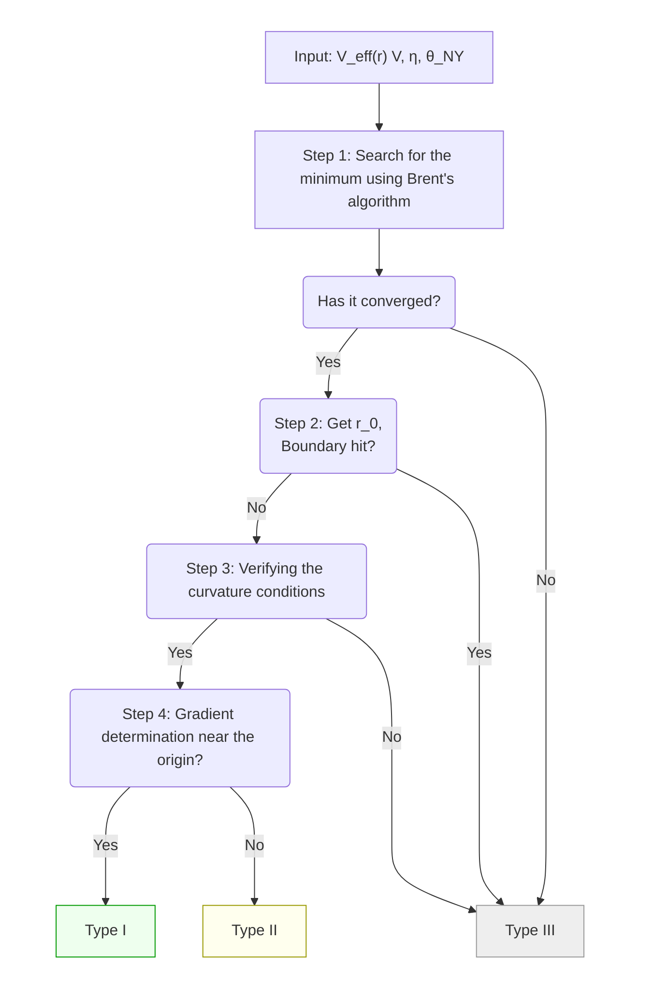

# 付録C：数値計算の詳細

本付録では、相図生成に用いた数値計算の詳細を記述する。特に、(C.1) スキャンパラメータと探索範囲、(C.2) 極値探索アルゴリズムと収束基準、(C.3) boundary hit の判定と処理、(C.4) Type 判定のフローチャートを系統的にまとめる。

また、結果の再現のために (C.5) 実装と計算環境 について記載した。(C.6) 数値精度と不確かさ、および (C.7) エッジケースの処理 については、数値計算における実務的な対処について記載した。

---

## C.1 スキャンパラメータと探索範囲

### C.1.1 パラメータグリッド

相図生成のため、以下の3次元パラメータ空間をグリッドスキャンした：

| パラメータ | 記号 | 範囲 | グリッド点数 | グリッド間隔 |
|:----------|:----:|:----:|:-----------:|:-----------:|
| Vector torsion 振幅 | $V$ | $[0, 5]$ | 51 | $\Delta V = 0.1$ |
| Axial torsion 振幅 | $\eta$ | $[-10, 5]$ | 151 | $\Delta\eta = 0.1$ |
| Nieh-Yan 結合 | $\theta_{NY}$ | $[0, 5]$ | 51 | $\Delta\theta = 0.1$ |

**総スキャン点数**：各トポロジー・各 NY variant について $51 \times 151 \times 51 = 392,\!901$ 点。3 トポロジー × 3 variant で総計約 350 万点の評価を実施した。

**備考**：本論文の図表では $\theta_{NY} \leq 2$ の範囲の結果を主に提示しているが、データ自体はより広い範囲（ $\theta_{NY} \leq 5$ ）で取得済みである。


### C.1.2 固定パラメータ

以下のパラメータは全スキャンを通じて固定した：

| パラメータ | 記号 | 値 | 備考 |
|:----------|:----:|:--:|:-----|
| 重力結合定数 | $\kappa$ | 1 | 無次元化 |
| $S^1$ 方向周長 | $L$ | 1 | 無次元化 |
| $T^3$ の追加スケール | $\alpha, \beta$ | 1 | 等方的トーラスを仮定 |


### C.1.3 半径 $r$ の探索範囲

有効ポテンシャル $V_{\text{eff}}(r)$ の極値探索は以下の範囲で実行した：

#### (式 C.1)

$$
r \in [r_{\min}, r_{\max}] = [0.01, 10^6]
$$

この広い範囲は、異なるパラメータ領域で安定半径 $r_0$ が大きく変動しうることを考慮したものである。Sec. 6.5 で示したスケーリング則 $r_0 \propto 1/V$ により、 $V \to 0$ の極限では $r_0 \to \infty$ となるため、上限を十分大きく設定した。

---

## C.2 極値探索アルゴリズムと収束基準

### C.2.1 最適化手法

極値探索には **Brent 法**（`scipy.optimize.minimize_scalar` の `bounded` モード）を使用した。Brent 法は黄金分割探索と放物線補間を組み合わせた手法であり、滑らかな1次元関数の極小探索に適している。

**収束基準**：SciPy のデフォルト設定を採用
- 相対許容誤差： $\texttt{xatol} = 1.48 \times 10^{-8}$ （浮動小数点精度の平方根）
- 最大反復回数：500


### C.2.2 曲率条件の検証

見つかった極値点 $r_0$ が真の極小であることを確認するため、2階微分（曲率）を数値微分で評価した：

#### (式 C.2)

$$
\frac{d^2 V_{\text{eff}}}{dr^2}\bigg|_{r=r_0} \approx \frac{V_{\text{eff}}(r_0 + h) - 2V_{\text{eff}}(r_0) + V_{\text{eff}}(r_0 - h)}{h^2}
$$

ここで刻み幅は $h = 10^{-5}$ を使用した。

**判定基準**：

$$
\frac{d^2 V_{\text{eff}}}{dr^2}\bigg|_{r=r_0} > 0 \quad \Rightarrow \quad \text{Minimal stable}
$$

この条件を満たさない場合、当該パラメータ点は Type III（不安定）に分類される。

---

## C.3 Boundary Hit の判定と処理

### C.3.1 境界閾値

極値探索の結果が探索範囲の境界近傍に位置する場合、物理的に意味のある安定点とは見なさない。以下の条件で **boundary hit** を判定する：

#### (式 C.3)

$$
r_0 < r_{\min} + \delta \quad \text{or} \quad r_0 > r_{\max} - \delta
$$

ここで境界閾値は $\delta = 0.02$ を採用した。


### C.3.2 Boundary hit の物理的意味

| 条件 | 物理的解釈 |
|:-----|:----------|
| $r_0 < r_{\min} + \delta$ | 極小が原点近傍に張り付き → 実効的に安定半径なし |
| $r_0 > r_{\max} - \delta$ | 極小が無限遠に逃げる → decompactification 的挙動 |

いずれの場合も、当該パラメータ点は **Type III（不安定 / 境界張り付き）** に分類される。

---

## C.4 Type 判定フローチャート

各パラメータ点 $(V, \eta, \theta_{NY})$ に対する Type 分類は、以下のフローに従って決定される：




### C.4.1 Type 分類の操作的定義

| Type | 条件 | 物理的意味 |
|:----:|:-----|:----------|
| **I** | 極小あり + $dV/dr\|_{r\to 0^+} > 0$ | 原点に障壁、量子トンネルが必要 |
| **II** | 極小あり + $dV/dr\|_{r\to 0^+} < 0$ | 原点から古典的に rolling |
| **III** | 極小なし or boundary hit or 曲率条件不満足 | 安定な有限半径が存在しない |


### C.4.2 障壁高 $\Delta V$ の計算

**Type I の場合**：

#### (式 C.4)

$$
\Delta V = \max_{r \in [r_{\min}, r_0]} V_{\text{eff}}(r) - V_{\text{eff}}(r_0)
$$

極小点 $r_0$ より原点側の最大値から極小値を引いた値として定義する。

**Type II の場合**：

#### (式 C.5)

$$
\Delta V = V_{\text{eff}}(r_{\min}) - V_{\text{eff}}(r_0)
$$

原点近傍の値から極小値を引いた「井戸の深さ」として定義する。

---

## C.5 実装と計算環境

コードへのアクセスおよび実行する上で必要になるものの情報については、付録F を参照。

### C.5.1 ソフトウェア

- **プログラム**：DPPUv2 parameter scan v3.0
- **並列化**：`multiprocessing.Pool` による並列処理

### C.5.2 並列化

スキャンは `multiprocessing.Pool` を用いて並列化した。各パラメータ点の評価は独立であるため、embarrassingly parallel な構造を持つ。

**実行パラメータ**：
- ワーカー数：20
- 処理時間：約 10 分（全トポロジー・全 variant）

**備考**：処理時間は計算環境（CPU 性能、コア数）に依存する。

### C.5.3 基本的な使用法

```bash
# デフォルト設定で全スキャン
python DPPUv2_parameter_scan_v3.py

# 解像度を下げてテスト実行
python DPPUv2_parameter_scan_v3.py --V-points 20 --eta-points 30 --theta-points 10

# 特定のトポロジーのみ
python DPPUv2_parameter_scan_v3.py --topologies S3 Nil3

# 出力ディレクトリの指定
python DPPUv2_parameter_scan_v3.py --output-dir ./my_results
```

### C.5.4 コマンドラインオプション

| オプション | デフォルト | 説明 |
|:----------|:---------:|:-----|
| `--V-points` | 51 | $V$ 方向のグリッド点数 |
| `--eta-points` | 151 | $\eta$ 方向のグリッド点数 |
| `--theta-points` | 51 | $\theta_{NY}$ 方向のグリッド点数 |
| `--V-min`, `--V-max` | 0, 5 | $V$ の範囲 |
| `--eta-min`, `--eta-max` | -10, 5 | $\eta$ の範囲 |
| `--theta-min`, `--theta-max` | 0, 5 | $\theta_{NY}$ の範囲 |
| `--topologies` | S3 T3 Nil3 | スキャン対象トポロジー |
| `--ny-variants` | FULL TT REE | スキャン対象 variant |
| `--workers` | (自動) | 並列ワーカー数 |

### C.5.5 CSV ファイル構造

スキャン結果は CSV 形式で出力される：

```
topology,ny_variant,V,eta,theta,r0,delta_V,stability_type
S3,FULL,0.0,-10.0,0.0,,,type-III
S3,FULL,0.1,-10.0,0.0,12.345,678.9,type-I
S3,FULL,0.2,-10.0,0.0,6.789,234.5,type-II
...
```

### C.5.6 フィールド定義

| フィールド | 型 | 説明 |
|:----------|:--:|:-----|
| `topology` | str | トポロジー識別子 |
| `ny_variant` | str | NY variant |
| `V` | float | Vector torsion 振幅 |
| `eta` | float | Axial torsion 振幅 |
| `theta` | float | Nieh-Yan 結合 |
| `r0` | float | 安定半径（Type III では空） |
| `delta_V` | float | 障壁高 / 井戸深さ |
| `stability_type` | str | Type 分類 |

### C.5.7 ファイル命名規則

```
dppu_scan_all_{timestamp}.csv          # 全データ統合
dppu_scan_{topology}_{variant}_{timestamp}.csv  # 個別ファイル
```

---

## C.6 数値精度と不確かさ

### C.6.1 グリッド解像度による不確かさ

相境界の位置はグリッド間隔程度の不確かさを持つ：
- $\Delta\eta \approx 0.1$
- $\Delta V \approx 0.1$
- $\Delta\theta_{NY} \approx 0.1$

Sec. 6.6 で示したように、解析的境界条件と数値スキャン結果はこの範囲内で整合する。


### C.6.2 極値探索の数値誤差

Brent 法の収束精度（ $\sim 10^{-8}$ ）は、物理的に意味のある桁数（ $r_0$ の有効数字 3-4 桁）に対して十分である。


### C.6.3 曲率検証の刻み幅依存性

曲率の数値微分における刻み幅 $h = 10^{-5}$ は、丸め誤差と打ち切り誤差のバランスを考慮して選定した。 $h = 10^{-4}$ ～ $10^{-6}$ の範囲で結果に有意な変化がないことを確認している。

---

## C.7 エッジケースの処理

### C.7.1 $V = 0$ の処理

$V = 0$ のとき、有効ポテンシャルの $r^2$ 項係数 $A$ がゼロとなり、ポテンシャルの形状が変化する。数値的には $V = 0$ もグリッド点に含まれるが、多くの場合 Type III に分類される。


### C.7.2 $\eta = 0$ の処理

$T^3$ において $\eta = 0$ は $C = 0$ 境界に対応し、Type 遷移が生じる臨界点である。グリッドがこの点を含むように設計されている。


### C.7.3 数値的に不安定なケース

極めて大きな $|V_{\text{eff}}|$ やオーバーフローが生じるパラメータ領域では、例外処理により Type III に分類される。このようなケースは全スキャン点の 0.1% 未満である。
