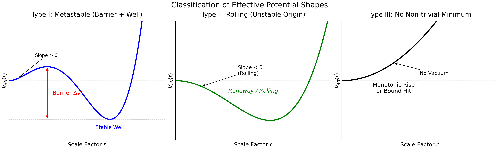
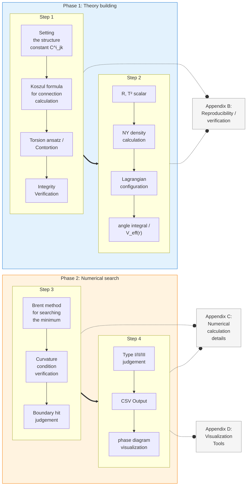

## 2. 定式化と規約（Setup and conventions）

本節では、本論文で用いる EC+NY の定式化、*minisuperspace* 還元の前提、パラメータ・記法、および数値スキャンにおける分類規約（Type I/II/III）をまとめる。本論文の主結果（相図・分類表・代表点）は、ここで定義した規約に基づいて得られる。

### 2.1 EC+NY の基本変数と記法

本論文は、（ユークリッド署名の）Einstein-Cartan 理論を第一形式（coframe/接続）で扱う。基本変数は coframe（テトラッド1-形式） $\{e^a\}$ と独立なスピン接続 $\omega^{ab}$ である。トーション2-形式 $T^a$ と曲率2-形式 $R^{ab}$ は

$$T^a := d e^a + \omega^a{}_b \wedge e^b$$

$$R^{ab} := d \omega^{ab} + \omega^a{}_c \wedge \omega^{cb}$$

で定義する。

#### EC 接続と Contortion：

Einstein-Cartan 接続 $\Gamma^a_{\mathrm{EC},bc}$ は、Levi-Civita 接続 $\Gamma^a_{\mathrm{LC},bc}$ と contortion $K^a{}_{bc}$ の和として表される：

$$\Gamma^a_{\mathrm{EC},bc} = \Gamma^a_{\mathrm{LC},bc} + K^a{}_{bc}$$

Contortion は torsion から以下のように定まる（Hehl et al. 1976 の規約に従う）：

$$K_{abc} = \frac{1}{2}\left( T_{abc} + T_{bca} - T_{cab} \right)$$

ここで添字はすべて下げた形で記述している。

#### 符号規約：

本論文では以下の規約を採用する：

- Frame metric： $\eta_{ab} = \mathrm{diag}(+1, +1, +1, +1)$ （ユークリッド署名）
- Riemann テンソル（第3・4添字で反対称）： $R^{a}{}_{bcd} = \partial_c \Gamma^{a}{}_{bd} - \partial_d \Gamma^{a}{}_{bc} + \Gamma^{a}{}_{ec}\Gamma^{e}{}_{bd} - \Gamma^{a}{}_{ed}\Gamma^{e}{}_{bc}$
- Contortion：Hehl et al. (1976) の規約に従い $K_{abc} = \frac{1}{2}(T_{abc} + T_{bca} - T_{cab})$
- Levi-Civita 記号： $\varepsilon_{0123} = +1$

以後、外積は $\wedge$ と書く。添字規約（内部指標 $a,b,\ldots$ と座標指標の区別）の詳細および導出の補足は Appendix A にまとめる。

### 2.2 Nieh-Yan 密度と Nieh-Yan 項

Nieh-Yan 密度（4-形式） $N$ は、coframe と torsion を用いて定義される幾何学的量であり、全微分として以下の形で表される：

$$N = d( e^a \wedge T_a )$$

本論文で扱う「Nieh-Yan (NY) 項」とは、作用における寄与としての $\theta_{\mathrm{NY}} N$（ $\theta_{\mathrm{NY}}$  は結合定数）を指す。

#### NY 密度の成分分解：

Frame 基底における計算では、NY 密度は以下の2つの寄与に分解される：

$$N = N_{\mathrm{TT}} - N_{\mathrm{REE}}$$

ここで：
- $N_{\mathrm{TT}}$：torsion-torsion 項。 $\frac{1}{4}\varepsilon^{abcd} T^{e}{}_{ab} T_{ecd}$ の形をとる。
- $N_{\mathrm{REE}}$：Riemann-torsion 項。 $\frac{1}{4}\varepsilon^{abcd} R_{abcd}$ の形をとる（EC 接続による曲率）。

本論文では、完全な NY 密度を用いる **FULL** ケースを主対象とし、各寄与の役割を診断するために **TT**（ $N_{\mathrm{TT}}$ のみ）および **REE**（ $N_{\mathrm{REE}}$ のみ）も併用する。

#### 全微分性に関する注記：

NY 密度が全微分として書けることは、閉多様体上の積分がトポロジカル不変量となりうることを意味する。ただし、minisuperspace 還元においては、ansatz の対称性により境界項の寄与が非自明となる場合がある。本研究の範囲では、還元により得られる $V_{\mathrm{eff}}(r)$ の相構造への影響を操作的に分類する。

### 2.3 minisuperspace 還元（Reduction scheme）

#### 2.3.1 還元の基本方針

本論文の *minisuperspace* 還元は、空間的同次性を仮定した ansatz を作用に代入し、空間積分により有限自由度の有効作用へ縮約する手続きである。

具体的には、4次元ユークリッド多様体を $\mathcal{M}_4 = \mathcal{M}_3 \times S^1$ の形に分解し、 $\mathcal{M}_3$ として左不変 coframe を許容する3次元 Lie 群のコンパクト商を採用する。 $S^1$ 方向の周長を $L$ とし、 $\mathcal{M}_3$ の「サイズ」を単一のスケールパラメータ $r$ で特徴づける。

この設定により、場の自由度は以下の有限個のパラメータに縮約される：
- 空間スケール変数 $r$（有効ポテンシャル $V_{\mathrm{eff}}(r)$ の引数）
- Torsion の振幅を指定する有限個のパラメータ（Sec.2.4.1 参照）

#### 2.3.2 coframe と構造定数

3次元空間 $\mathcal{M}_3$ 上に左不変 coframe $\{\sigma^i\}$（ $i = 0, 1, 2$ ）を導入し、4次元 coframe を

$$
\begin{aligned}
e^a &= r \, \sigma^i \quad (a = i = 0,1,2) \\
e^a &= L \, d\tau \quad (a = 3)
\end{aligned}
$$

と構成する。ここで $\tau \in [0, 1)$ は $S^1$ 方向の周期座標である。

左不変 coframe は Maurer-Cartan 構造方程式

$$
d\sigma^i = -\frac{1}{2} C^i{}_{jk} \, \sigma^j \wedge \sigma^k
$$

を満たす。構造定数 $C^i{}_{jk}$ は $\mathcal{M}_3$ の幾何学を特徴づけ、本論文で扱う3つのテストベッドに対して以下の値をとる：

| トポロジー | 構造定数 | 背景 Ricci スカラー $R_{\mathrm{LC}}$ |
|-----------|---------|-----------------------------------|
| $S^3$（SU(2)） | $C^{i}{}_{jk} = \frac{4}{r} \varepsilon_{ijk}$ | $+24/r^2$ （正曲率） |
| $T^3$ （Abelian） | $C^{i}{}_{jk} = 0$ | $0$ （平坦） |
| $Nil^3$ （Heisenberg） | $C^{2}{}_{01} = -1/r$, $C^{2}{}_{10} = +1/r$ , 他は 0 | $-1/(2r^2)$ （負曲率） |

ここで $\varepsilon_{ijk}$ は3次元 Levi-Civita 記号である。

なお、構造定数の $r$ 依存性は、正規直交フレーム $e^a = r \, \sigma^a$ を採用した結果である。 $\sigma^a$ は「単位サイズ」の左不変 coframe であり、物理的なスケール $r$ による rescaling が構造定数に $1/r$ 因子をもたらす。

#### 2.3.3 Torsion Ansatz：既約分解に基づく parametrization

Einstein-Cartan 理論において、torsion テンソル $T^a{}_{bc}$ は coframe と独立な幾何学的自由度である。4次元における torsion の既約分解（Hehl et al. 1976）に従い、本論文では以下の2成分を導入する：

#### T1 成分（完全反対称 / Axial）：

空間方向に完全反対称な torsion として

$$
T^{(1)}_{abc} = \frac{2\eta}{r} \ \varepsilon_{abc} \quad (a, b, c \in \{0, 1, 2\})
$$

を採用する。ここで $\eta$ は無次元パラメータであり、符号を含めて走査する。

この成分は、torsion の擬ベクトル（axial vector）部分 $S^\mu = \varepsilon^{\mu\nu\rho\sigma} T_{\nu\rho\sigma}$ に対応し、 $S^3$ が $0$ でない値をとる。

#### T2 成分（ベクトルトレース / Vector trace）：

$S^1$ 方向に沿ったベクトル $V_\mu = (0, 0, 0, V)$ を用いて

$$
T^{(2)}_{abc} = \frac{1}{3} \left( \eta_{ac} V_b - \eta_{ab} V_c \right)
$$

を採用する。ここで $V > 0$ は正値パラメータ、 $\eta_{ab}$ は frame metric（本論文では $\delta_{ab}$ ）である。

この成分は torsion のベクトルトレース部分 $T_\mu = T^\lambda{}_{\mu\lambda}$ に対応する。

#### Mode の定義：

T1 と T2 の組み合わせにより、以下の3つの計算 mode を定義する：

| Mode | T1（Axial） | T2（Vector） | 独立パラメータ |
|------|------------|-------------|---------------|
| AX | $\checkmark$ | $-$ | $\eta$ |
| VT | $-$ | $\checkmark$ | $V$ |
| MX | $\checkmark$ | $\checkmark$ | $\eta$, $V$ |

本論文の主要結果は MX mode（mixed）に基づく。AX および VT mode は、各 torsion 成分の寄与を切り分けるための診断に用いる。

### 2.4 パラメータと走査変数

#### 2.4.1 パラメータ一覧

本論文で用いる主要パラメータを以下にまとめる：

##### 幾何学的パラメータ：
- $r$：空間スケール変数。 $V_{\mathrm{eff}}(r)$ の引数であり、 $r > 0$ の範囲で走査する。
- $L$： $S^1$ 方向の周長。本論文では $L = 1$ に固定する。

##### Torsion パラメータ：
- $\eta$：軸性 torsion 振幅（axial torsion amplitude）。符号を含め $\eta \in [-10, 5]$ の範囲で走査する。
- $V$：ベクトル torsion 振幅（vector torsion amplitude）。 $V \in [0, 5]$ の範囲で走査する。

##### 結合定数：
- $\kappa$：重力結合定数。本論文では $\kappa = 1$ に固定する。
- $\theta_{\mathrm{NY}}$：Nieh-Yan 結合。 $\theta_{\mathrm{NY}} \in [0, 5]$ の範囲で走査する。 $\theta_{\mathrm{NY}} < 0$ の場合は有効ポテンシャルの $B$ 項（ $r^2$ 係数）の符号が反転し、相構造は $\eta$ 方向に鏡映されるため、正の範囲の結果から推測可能である。

#### 2.4.2 走査戦略

相図の生成においては、主に $(V, \eta)$ 平面を $\theta_{\mathrm{NY}}$ の代表値（ $\theta_{\mathrm{NY}} = 0, 1, 2$ など）ごとにスライスして可視化する。

各パラメータ点に対し、 $r$ の許容領域 $[r_{\min}, r_{\max}] = [0.01, 10^6]$ において $V_{\mathrm{eff}}(r)$ の極値探索を行い、Type I/II/III の分類（Sec. 2.6）を判定する。

#### 2.4.3 次元解析に関する注記

本論文では $\kappa = L = 1$ と固定するため、すべての量は無次元化されている。物理的単位を復元する場合、 $r$ は Planck 長 $\ell_P = \sqrt{\hbar G / c^3}$ を単位とし、 $V_{\mathrm{eff}}$ は $\hbar c / \ell_P$ を単位とする。ただし、本論文の主眼は相構造の分類であり、絶対的なスケールは議論しない。

### 2.5 有効ポテンシャルの定義と「静的点」

本研究では、還元により得られる有効作用 $S_{\mathrm{eff}}$ から、 $r$ の有効ポテンシャル $V_{\mathrm{eff}}(r)$ を以下のように定義する。

#### 導出手順：

1. EC+NY 作用に Sec. 2.3 の ansatz を代入
2. 空間方向の積分を実行し、 $r$ のみに依存する有効作用 $S_{\mathrm{eff}}[r]$ を得る
3. 有効ポテンシャルを $V_{\mathrm{eff}}(r) := -S_{\mathrm{eff}}[r]$ と定義

この符号規約により、 $V_{\mathrm{eff}}(r)$ の極小点は作用の極大点（ユークリッド経路積分における支配的寄与）に対応する。

#### 静的点の定義：

有効ポテンシャルの極値条件
$$\frac{dV_{\mathrm{eff}}}{dr} = 0$$
を満たす点 $r = r_0$ を「静的点」と呼ぶ。さらに
$$\frac{d^2 V_{\mathrm{eff}}}{dr^2}\bigg|_{r=r_0} > 0$$
を満たす場合、 $r_0$ は局所極小であり、安定な静的点となる。

以後、 $V_{\mathrm{eff}}(r)$ の形状（極値と障壁）に基づいて相（Type）を操作的に分類する。

### 2.6 Type I/II/III：相の操作的定義

本論文では、 $V_{\mathrm{eff}}(r)$ の形状により以下の3類型を定義する。「相」は便宜的表現であり、熱力学的相転移ではなく操作的分類を意味する。Fig.1 にて各相のポテンシャル形状を示す。

#### Fig.1: Schematic Classification

#### Type I：障壁付きメタ安定井戸（metastable well with barrier）

- $V_{\mathrm{eff}}(r)$ が許容領域内に局所極小 $r_0$ を持つ
- $r \to 0$ 方向において、 $V_{\mathrm{eff}}(r)$ が $V_{\mathrm{eff}}(r_0)$ より大きな値をとる領域が存在する（障壁）
- 数値判定： $r_0$ における $V_{\mathrm{eff}}$ と、 $r < r_0$ における最大値の差 $\Delta V > 0$

#### Type II：Rolling（障壁なし）

- $V_{\mathrm{eff}}(r)$ が許容領域内に局所極小 $r_0$ を持つ
- ただし、 $r \to 0$ 方向に障壁が存在しない（ $\Delta V \approx 0$ または $V_{\mathrm{eff}}$ が単調減少）
- 数値判定： $dV_{\mathrm{eff}}/dr|_{r \to 0^+} < 0$ （原点近傍で下り勾配）

#### Type III：不安定／境界張り付き（unstable / boundary-attached）

- 許容領域内に安定な局所極小が存在しない
- 典型例：
  - 極値探索が $r_{\min}$ または $r_{\max}$ に到達（bound hit）
  - 極小の曲率条件 $d^2V/dr^2 > 0$ を満たさない
  - 数値的に収束しない

**注記：** Type I/II の区別は、 $r = 0$ 近傍における $V_{\mathrm{eff}}$ の振る舞いに依存する。Type I では原点付近に「壁」が存在し量子トンネルを要するのに対し、Type II では古典的に rolling down が可能である。ただし、本論文では動力学的発展（トンネル率、Friedmann 方程式）は扱わない。

### 2.7 数値判定規約

#### 2.7.1 探索領域と bound hit

極値探索は $r \in [r_{\min}, r_{\max}] = [0.01, 10^6]$ の範囲で実行する。探索結果が境界近傍
$$r_0 < r_{\min} + \delta \quad \text{または} \quad r_0 > r_{\max} - \delta$$
に到達した場合（ $\delta = 0.02$ ）、bound hit として Type III に分類する。

#### 2.7.2 障壁高 $\Delta V$ の定義と閾値

Type I の場合、障壁高 $\Delta V$ は以下で定義する：

$$\Delta V := \max_{r \in [r_{\min}, r_0]} V_{\mathrm{eff}}(r) - V_{\mathrm{eff}}(r_0)$$

$\Delta V > 0$ かつ $dV_{\mathrm{eff}}/dr|_{r \to 0^+} > 0$ の場合に Type I と判定する。

#### 2.7.3 曲率条件

極小点 $r_0$ における曲率を数値微分で評価し、
$$\frac{d^2 V_{\mathrm{eff}}}{dr^2}\bigg|_{r=r_0} > 0$$
を確認する。この条件を満たさない場合、Type III に分類する。

詳細な数値パラメータおよびエッジケースの処理は Appendix C にまとめる。

### 2.8 Nieh-Yan の取り込み：FULL と診断用比較（TT/REE）

本研究の主対象は、NY 密度の完全形を作用に組み込む **FULL** ケースである。加えて、FULL の寄与の由来を切り分けるための診断用比較として **TT** および **REE** を併用する。

| 取り込み方 | 採用する NY 密度 | 目的 |
|-----------|----------------|------|
| FULL | $N = N_{\mathrm{TT}} - N_{\mathrm{REE}}$ | 主要結果（完全な NY 効果） |
| TT | $N_{\mathrm{TT}}$ のみ | torsion-torsion 寄与の診断 |
| REE | $N_{\mathrm{REE}}$ のみ | Riemann-torsion 寄与の診断 |

#### 計算における具体的処理：

エンジン（DPPUv2 Engine Core v3）は、各ステップで $N_{\mathrm{TT}}$ 、 $N_{\mathrm{REE}}$ 、 $N_{\mathrm{FULL}}$ を全て計算し、指定された variant に応じて Lagrangian に組み込む NY 密度を選択する。

#### 診断用比較の意義：

TT/REE は独立の基礎理論として提案するものではなく、FULL の相構造がどの寄与により駆動されるかを理解するための補助的な比較である。例えば：
- TT と REE で相境界が大きく異なる場合 → 両寄与の競合が相構造を決定
- TT と FULL がほぼ同一の場合 → torsion-torsion 項が支配的

この診断により、トポロジー依存性の幾何学的起源を切り分けることが可能となる。

## 2.9 計算パイプラインの概要

本研究の数値結果は、Fig. 2 に示す計算パイプラインにより得られる。パイプラインは大きく2つのフェーズから構成される：**理論構築フェーズ**（記号計算による $V_{\mathrm{eff}}(r)$ の導出）と**数値探索フェーズ**（パラメータスキャンによる相分類）。

### Phase 1: 理論構築フェーズ（記号計算）

#### Step 1：幾何学的セットアップと接続計算

トポロジーに応じた構造定数 $C^i{}_{jk}$ を設定し（Sec. 2.3.2）、一般 Koszul 公式により Levi-Civita 接続を計算する。Torsion ansatz（Sec. 2.3.3）から contortion を導出し、EC 接続を構成する。各ステップで metric compatibility および Riemann テンソルの反対称性を自動検証する。

導出の詳細は Appendix A、エンジン仕様と検証は Appendix B を参照。

#### Step 2：有効ポテンシャルの導出

EC 接続から Ricci スカラー $R$、torsion スカラー $T_{abc}T^{abc}$、および NY 密度（ $N_{\mathrm{TT}}$, $N_{\mathrm{REE}}$, $N_{\mathrm{FULL}}$ ）を計算する。Lagrangian 密度

$$
\mathcal{L} = \frac{R}{2\kappa^2} + \theta_{NY} N
$$

を構成し、角度積分により有効作用 $S_{\mathrm{eff}}$ を得る。有効ポテンシャルは $V_{\mathrm{eff}}(r) = -S_{\mathrm{eff}}$ として抽出される。

各トポロジー・各 NY variant の解析的結果は Appendix A.3 にまとめる。

### Phase 2: 数値探索フェーズ（パラメータスキャン）

#### Step 3：極値探索と安定性判定

各パラメータ点 $(V, \eta, \theta_{NY})$ に対し、 $r \in [r_{\min}, r_{\max}]$ の範囲で $V_{\mathrm{eff}}(r)$ の極値を数値探索する。極値探索には Brent 法を使用し、曲率条件 $d^2V_{\mathrm{eff}}/dr^2 > 0$ を数値微分で検証する。

探索アルゴリズムの詳細は Appendix C.2 を参照。

#### Step 4：Type 分類と相図生成

Sec. 2.6–2.7 の基準に従い、各パラメータ点を Type I/II/III に分類する。分類結果を CSV 形式で出力し、 $(V, \eta)$ 平面上の相図を生成する。

Type 判定フローチャートは Appendix C.4、可視化ツールは Appendix D を参照。

### 実装と再現性

計算は SymPy による記号計算として実装されており（DPPUv2 Engine Core v3）、各ステップで整合性チェック（metric compatibility、Riemann 反対称性の3段階検証等）を自動実行する。パラメータスキャンは並列化により高速化している。

エンジン仕様とサニティチェック一覧は Appendix B、コードとデータのアクセス情報は Appendix F を参照。

#### Fig.2: Computational Pipeline

