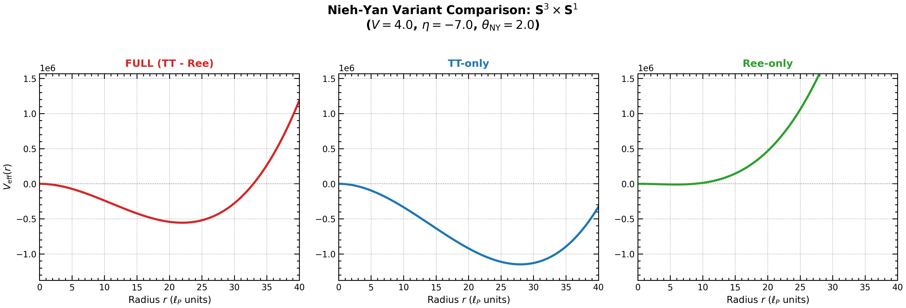
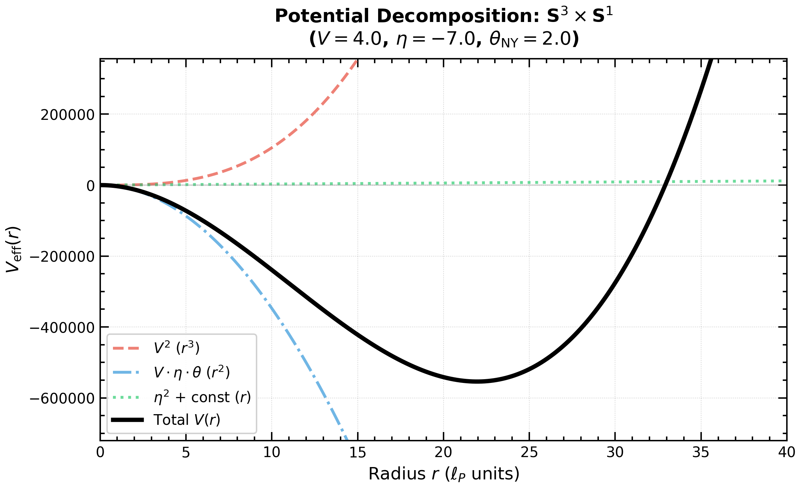
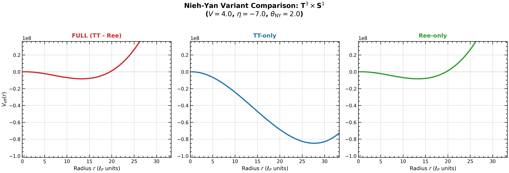
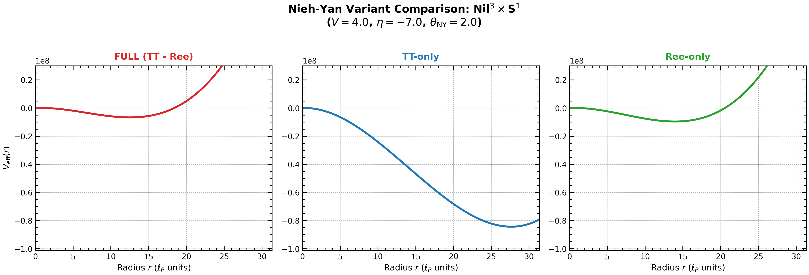
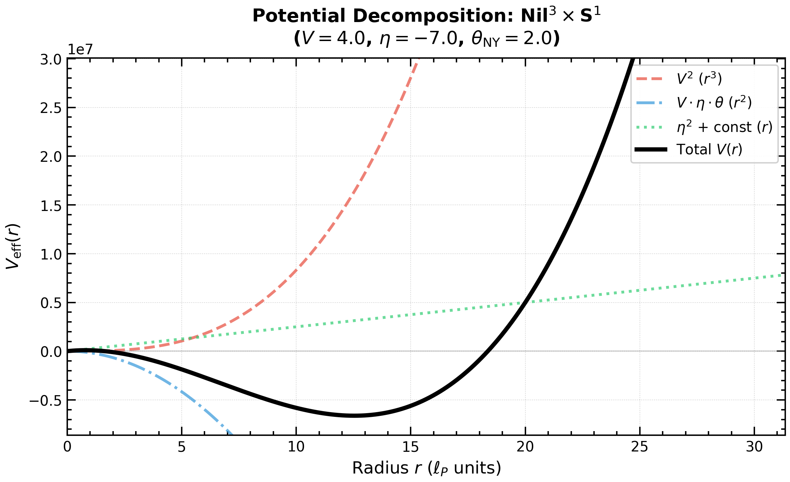

## 3. トポロジー別の還元（Topology-specific reductions）

本節では、Sec. 2 で定義した minisuperspace 還元を3つのテストベッド（ $S^3$, $T^3$, $Nil^3$ ）に適用し、各トポロジーにおける有効ポテンシャル $V_{\mathrm{eff}}(r)$ の具体的な形を導出する。

### 3.1 $S^3 \times S^1$：還元作用と有効ポテンシャル

#### 3.1.1 幾何学的設定

$S^3$ は SU(2) 群多様体として実現され、左不変 coframe $\{\sigma^i\}$ は SU(2) の Maurer-Cartan 形式で与えられる。構造定数は

$$
C^{i}{}_{jk} = \frac{4}{r} \varepsilon_{ijk}
$$

であり、背景 Ricci スカラー（torsion なし）は

$$
R_{\mathrm{LC}} = \frac{24}{r^2} > 0
$$

となる（正曲率）。体積要素は

$$
\mathrm{Vol}(S^3 \times S^1) = 2\pi^2 L r^3
$$

である。

#### 3.1.2 スカラー量の計算結果

MX mode（ $\eta \neq 0$, $V \neq 0$ ）における各スカラー量は以下のとおりである（DPPUv2 Engine Core v3 による計算）：

##### Ricci スカラー：
$$R = \frac{2(-V^2 r^2 - 9\eta^2 - 72\eta - 108)}{3r^2}$$

##### Torsion スカラー：
$$T_{abc}T^{abc} = \frac{2V^2}{3} + \frac{24\eta^2}{r^2}$$

##### NY 密度（各 variant）：
$$N_{\mathrm{TT}} = -\frac{4V\eta}{r}, \quad N_{\mathrm{REE}} = -\frac{2V(\eta + 4)}{r}, \quad N_{\mathrm{FULL}} = \frac{2V(4 - \eta)}{r}$$

#### 3.1.3 有効ポテンシャル

Lagrangian $\mathcal{L} = R/(2\kappa^2) + \theta_{\mathrm{NY}} N$ を体積積分し、 $V_{\mathrm{eff}}(r) = -S_{\mathrm{eff}}$ として抽出すると、各 NY variant に対して以下を得る：

##### FULL（ $N = N_{\mathrm{FULL}}$ ）：
$$V_{\mathrm{eff}}^{(S^3,\mathrm{FULL})}(r) = \frac{2\pi^2 L}{3\kappa^2} r \left[ V^2 r^2 + 6V\kappa^2\theta_{\mathrm{NY}}(\eta - 4) r + 9\eta^2 + 72\eta + 108 \right]$$

##### TT（ $N = N_{\mathrm{TT}}$ ）：
$$V_{\mathrm{eff}}^{(S^3,\mathrm{TT})}(r) = \frac{2\pi^2 L}{3\kappa^2} r \left[ V^2 r^2 + 12V\eta\kappa^2\theta_{\mathrm{NY}} r + 9\eta^2 + 72\eta + 108 \right]$$

##### REE（ $N = N_{\mathrm{REE}}$ ）：
$$V_{\mathrm{eff}}^{(S^3,\mathrm{REE})}(r) = \frac{2\pi^2 L}{3\kappa^2} r \left[ V^2 r^2 + 6V\kappa^2\theta_{\mathrm{NY}}(\eta + 4) r + 9\eta^2 + 72\eta + 108 \right]$$

これらのポテンシャル形状をFig.3 に示す。

#### Fig.3: Nieh-Yan Variant comparison: $S^3 \times S^1$

#### 3.1.4 構造の分析

$S^3$ の有効ポテンシャルは $r$ の3次多項式（ $r^3 + r^2 + r$ 型）の構造を持つ：

$$V_{\mathrm{eff}}(r) \propto r \cdot \left[ A r^2 + B r + C \right]$$

ここで：
- $A = V^2 > 0$ ： $r \to \infty$ での発散を支配（常に正）
- $B$：NY 結合 $\theta_{\mathrm{NY}}$ に比例し、 $\eta$ に依存（符号可変）
- $C = 9\eta^2 + 72\eta + 108 = 9(\eta + 4)^2 - 36$ ： $\eta = -4$ で最小値 $-36$ をとる

この構造から、 $B < 0$ かつ $|B|$ が十分大きい場合に局所極小が出現しうる。特にFULL variant では $B \propto (\eta - 4)$ であり、 $\eta < 4$ で $B < 0$ となることから、 $\eta > 0$ の領域でも局所極小が出現しうる。

$r^3, r^2, r$ それぞれのポテンシャルへの寄与についてFig.4 に示す。

#### Fig.4: Potential Decomposition: $S^3 \times S^1$

### 3.2 $T^3 \times S^1$：還元作用と有効ポテンシャル

#### 3.2.1 幾何学的設定

$T^3$ は Abelian 群（ $\mathbb{R}^3$ の離散商）であり、構造定数は全て零：

$$C^i{}_{jk} = 0$$

背景 Ricci スカラーは

$$R_{\mathrm{LC}} = 0$$

（平坦）。体積要素は

$$\mathrm{Vol}(T^3 \times S^1) = (2\pi)^4 L R_1 R_2 R_3$$

である。ここで $R_1, R_2, R_3$ は $T^3$ の各方向の周長である。本論文では、 $S^3$ および $Nil^3$ との比較のため、等方的膨張 $R_1 = R_2 = R_3 = r$ を仮定する。これにより、他のトポロジーと同様に、単一スケールパラメータ $r$ で記述する。

#### 3.2.2 スカラー量の計算結果

MX mode における各スカラー量：

##### Ricci スカラー：
$$R = -\frac{2V^2}{3} - \frac{6\eta^2}{r^2}$$

##### Torsion スカラー：
$$T_{abc}T^{abc} = \frac{2V^2}{3} + \frac{24\eta^2}{r^2}$$

##### NY 密度（各 variant）：
$$N_{\mathrm{TT}} = -\frac{4V\eta}{r}, \quad N_{\mathrm{REE}} = -\frac{2V\eta}{r}, \quad N_{\mathrm{FULL}} = -\frac{2V\eta}{r}$$

注目すべき点として、 $T^3$ では $N_{\mathrm{FULL}} = N_{\mathrm{REE}}$ となる。これは背景曲率がゼロであることに起因する。

#### 3.2.3 有効ポテンシャル

等方的設定 $R_1 = R_2 = R_3 = r$ で、各 NY variant に対して：

##### FULL（= REE）：
$$V_{\mathrm{eff}}^{(T^3,\mathrm{FULL})}(r) = \frac{16\pi^4 L}{3\kappa^2} \left[ V^2 r^3 + 6V\eta\kappa^2\theta_{\mathrm{NY}} r^2 + 9\eta^2 r \right]$$

##### TT：
$$V_{\mathrm{eff}}^{(T^3,\mathrm{TT})}(r) = \frac{16\pi^4 L}{3\kappa^2} \left[ V^2 r^3 + 12V\eta\kappa^2\theta_{\mathrm{NY}} r^2 + 9\eta^2 r \right]$$

これらは $S^3$ と同様に $r^3 + r^2 + r$ 型の構造を持つ。

これらのポテンシャル形状をFig.5 に示す。

#### Fig.5: Nieh-Yan Variant comparison: $T^3 \times S^1$

#### 3.2.4 構造の分析

等方的設定により、 $T^3$ の有効ポテンシャルは $S^3$ や $Nil^3$ と同様の構造を持つ：

$$V_{\mathrm{eff}}(r) \propto r \cdot \left[ V^2 r^2 + B r + C \right]$$

ここで $B = 6V\eta\kappa^2\theta_{\mathrm{NY}}$ 、 $C = 9\eta^2$ である。

この形から：
- $r \to 0$ ： $V_{\mathrm{eff}} \to 0^+$ （ $C > 0$ のため、 $\eta \neq 0$ で常に正）
- $r \to \infty$ ： $r^3$ 項により $V_{\mathrm{eff}} \to +\infty$
- 極小の存在条件： $3V^2 r^2 + 2Br + C = 0$ が正の実数解を持つ

$T^3$ の特徴として、 $r$ の係数 $C = 9\eta^2$ が常に非負（ $\eta = 0$ でのみゼロ）であるため：
- $\theta_{\mathrm{NY}} = 0$ では $B = 0$ となり、 $dV_{\mathrm{eff}}/dr \propto 3V^2 r^2 + 9\eta^2 > 0$ （ $r > 0$ ）で常に単調増加（Type III）
- $\theta_{\mathrm{NY}} > 0$ かつ $\eta < 0$ では $B < 0$ となり、極小が形成されうる

$\eta \to -\eta$ 変換で $B \to -B$ となるため、 $\theta_{\mathrm{NY}} \neq 0$ では対称性が破れる。 $\theta_{\mathrm{NY}} > 0$ の場合、安定領域は $\eta < 0$ 側にのみ出現する。

$r^3, r^2, r$ それぞれのポテンシャルへの寄与についてFig.6 に示す。

#### Fig.6: Potential Decomposition: $T^3 \times S^1$

### 3.3 $Nil^3 \times S^1$：還元作用と有効ポテンシャル

#### 3.3.1 幾何学的設定

$Nil^3$ は Heisenberg 群（Bianchi Type II）のコンパクト商であり、構造定数は

$$
C^{2}{}_{01} = -\frac{1}{r}, \quad C^{2}{}_{10} = +\frac{1}{r}, \quad \text{others } 0
$$

となる。重要な点として、 $Nil^3$ は **bi-invariant ではない**（Heisenberg 群は冪零群であり半単純ではない）。このため、接続の計算には一般 Koszul 公式（Appendix A を参照）を用いる必要がある。

背景 Ricci スカラーは

$$R_{\mathrm{LC}} = -\frac{1}{2r^2} < 0$$

（負曲率）。体積要素は

$$\mathrm{Vol}(\mathrm{Nil}^3 \times S^1) = (2\pi)^4 L r^3$$

である。

#### 3.3.2 スカラー量の計算結果

MX mode における各スカラー量：

##### Ricci スカラー：
$$R = \frac{-4V^2 r^2 - 36\eta^2 + 24\eta + 9}{6r^2}$$

##### Torsion スカラー：
$$T_{abc}T^{abc} = \frac{2V^2}{3} + \frac{24\eta^2}{r^2}$$

##### NY 密度（各 variant）：
$$N_{\mathrm{TT}} = -\frac{4V\eta}{r}, \quad N_{\mathrm{REE}} = \frac{2V(1 - 3\eta)}{3r}, \quad N_{\mathrm{FULL}} = -\frac{2V(3\eta + 1)}{3r}$$

#### 3.3.3 有効ポテンシャル

各 NY variant に対して：

##### FULL：
$$V_{\mathrm{eff}}^{(\mathrm{Nil}^3,\mathrm{FULL})}(r) = \frac{4\pi^4 L}{3\kappa^2} r \left[ 4V^2 r^2 + 8V\kappa^2\theta_{\mathrm{NY}}(3\eta + 1) r + 36\eta^2 - 24\eta - 9 \right]$$

##### TT：
$$V_{\mathrm{eff}}^{(\mathrm{Nil}^3,\mathrm{TT})}(r) = \frac{4\pi^4 L}{3\kappa^2} r \left[ 4V^2 r^2 + 48V\eta\kappa^2\theta_{\mathrm{NY}} r + 36\eta^2 - 24\eta - 9 \right]$$

##### REE：
$$V_{\mathrm{eff}}^{(\mathrm{Nil}^3,\mathrm{REE})}(r) = \frac{4\pi^4 L}{3\kappa^2} r \left[ 4V^2 r^2 + 8V\kappa^2\theta_{\mathrm{NY}}(3\eta - 1) r + 36\eta^2 - 24\eta - 9 \right]$$

これらのポテンシャル形状をFig.7 に示す。

#### Fig.7: Nieh-Yan Variant comparison: $Nil^3 \times S^1$

#### 3.3.4 構造の分析

$Nil^3$ の有効ポテンシャルも $S^3$ と同様に $r^3 + r^2 + r$ 型の構造を持つが、係数の符号が違いをもたらす：

$$
C_{\mathrm{Nil}^3} = 36\eta^2 - 24\eta - 9 = 36\left(\eta - \frac{1}{3}\right)^2 - 13
$$

この2次関数は $\eta = 1/3$ で最小値 $-13$ をとり、 $\eta \in (-0.27, 0.94)$ の範囲で負となる。

 $r$ の係数 $C$ が負の場合、 $r \to 0$ で $V_{\mathrm{eff}}(r) \to 0^-$ となり、原点近傍でポテンシャルが負の値をとる。これは $S^3$ （ $C > 0$ となる領域が広い）と対照的であり、 $Nil^3$ において $\theta_{NY}$ が小さい値の場合に、安定領域が狭いバンドに限定されることを示唆する。

$r^3, r^2, r$ それぞれのポテンシャルへの寄与についてFig.8 に示す。

#### Fig.8: Potential Decomposition: $Nil^3 \times S^1$

### 3.4 構造の比較：トポロジー依存性の源泉

3つのトポロジーにおける有効ポテンシャルの構造を比較し、トポロジー依存性の源泉を整理する。

#### 3.4.1 有効ポテンシャルの一般形

全てのトポロジーにおいて、MX mode の有効ポテンシャルは以下の一般形で表される：

$$V_{\mathrm{eff}}(r) = \mathcal{N} \cdot r^{\alpha} \cdot P(r)$$

ここで $\mathcal{N}$ は正規化因子、 $\alpha$ はトポロジー依存の指数、 $P(r)$ は $r$ の多項式である。

| トポロジー | 構造 | $r \to 0$ | $r \to \infty$ |
|-----------|------|-----------|----------------|
| $S^3$ | $r  \cdot [Ar^2 + Br + C] $ | $\to 0$ | $\to +\infty$ |
| $T^3$ |  $r  \cdot [Ar^2 + Br + C] $ | $\to 0$  | $\to +\infty$ |
| $Nil^3$ |  $r  \cdot [Ar^2 + Br + C] $ | $\to 0$  | $\to +\infty$ |

$S^3$、 $T^3$、 $Nil^3$ いずれも  $r  \cdot [Ar^2 + Br + C] $  の構造を持つ。

#### 3.4.2 NY 密度の比較

| トポロジー | $N_{\mathrm{FULL}}$ | 背景曲率依存性 |
|-----------|-------------------|---------------|
| $S^3$ | $\frac{2V(4 - \eta)}{r}$ | $(4 - \eta)$：正曲率からの寄与 |
| $T^3$ | $-\frac{2V\eta}{r}$ | $\eta$ のみ：曲率寄与なし |
| $Nil^3$ | $-\frac{2V(3\eta + 1)}{3r}$ | $(3\eta + 1)$：負曲率からの寄与 |

$S^3$ の $N_{\mathrm{FULL}}$ に現れる因子 $(4 - \eta)$ は、 $N_{\mathrm{REE}}$ 中の $(\eta + 4)$ 項に由来する。この $+4$ は背景の正曲率（ $R_{\mathrm{LC}} = 24/r^2$ ）との結合を反映している。

一方、 $T^3$ では背景曲率がゼロのため、 $N_{\mathrm{FULL}}$ への曲率寄与がない。

#### 3.4.3 安定性に影響する幾何学的因子

有効ポテンシャルの極小の存在と位置は、主に以下の因子で決定される：

1. **$r^3$ 項の係数**（ $\propto V^2$ ）：常に正。 $r \to \infty$ での増大を支配。

2. **$r^2$ 項の係数**（ $\propto V\theta_{\mathrm{NY}} \times f(\eta)$ ）：NY 結合と $\eta$ の関数。符号が負の場合に極小形成を促進。

3. **$r$ 項の係数**：トポロジー固有の幾何学的寄与。 $S^3$ では $9(\eta + 4)^2 - 36$、 $T^3$ では $9η^2$ 、 $Nil^3$ では $36(\eta - 1/3)^2 - 13$ 。

これらの競合により、各トポロジーで異なる相構造が出現する。詳細な相境界の解析は Sec. 4 で行う。

