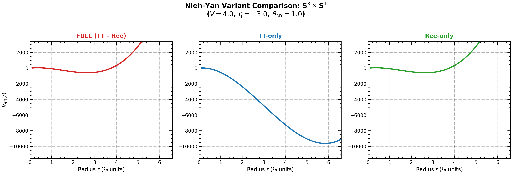
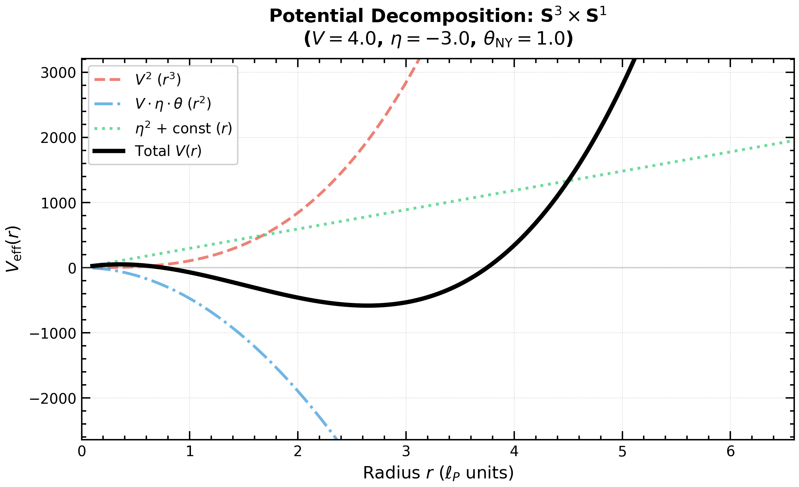
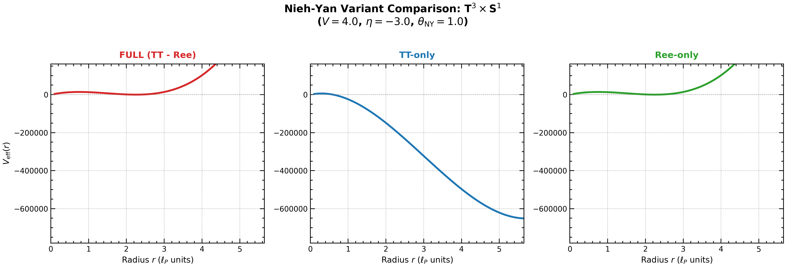
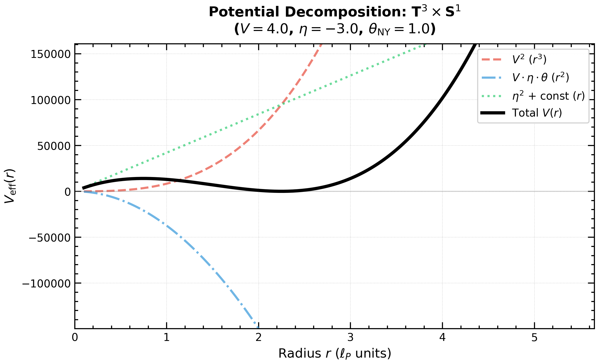
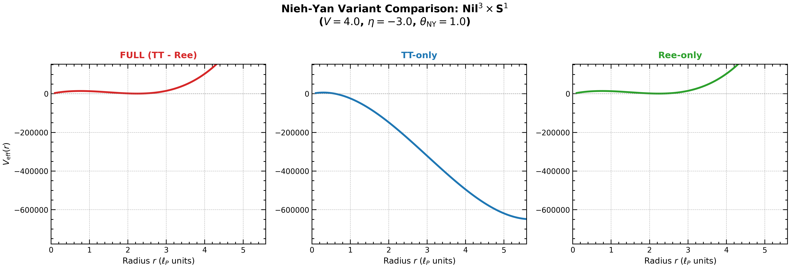
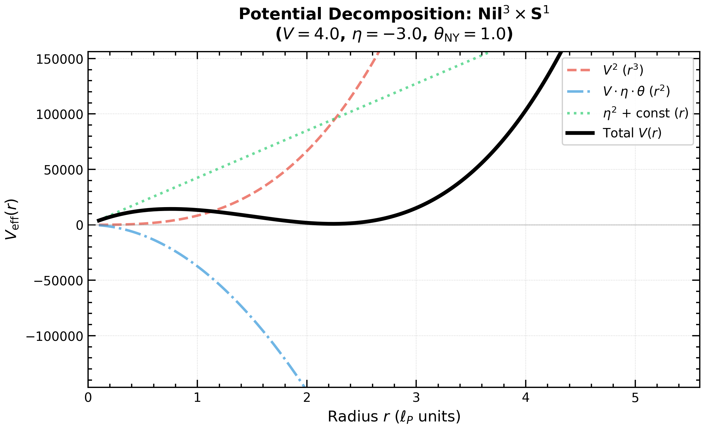

## 3. トポロジー別の還元（Topology-Specific Reductions）

本節では、Sec. 2 の minisuperspace 還元を $S^3,\ T^3,\ Nil^3$ に適用し、各トポロジーの有効ポテンシャル $V_{\mathrm{eff}}(r)$ を明示する。

### 3.1 $S^3 \times S^1$：還元作用と有効ポテンシャル

#### 3.1.1 幾何設定

- 構造定数： $C^{i}{}\_{jk}=\frac{4}{r}\varepsilon\_{ijk}$
- 背景 Ricci： $R_{\mathrm{LC}}=\frac{24}{r^2}>0$（正曲率）
- 体積： $\mathrm{Vol}(S^3\times S^1)=2\pi^2Lr^3$

#### 3.1.2 スカラー量（MX）

$$
R=\frac{2(-V^2r^2-9\eta^2+36)}{3r^2}
$$

$$
T_{abc}T^{abc}=\frac{2V^2}{3}+\frac{24\eta^2}{r^2}
$$

$$
N_{\mathrm{TT}}=-\frac{4V\eta}{r},\quad
N_{\mathrm{REE}}=-\frac{2V\eta}{r},\quad
N_{\mathrm{FULL}}=-\frac{2V\eta}{r}
$$

（ $N_{\mathrm{FULL}}=N_{\mathrm{REE}}$ ）

#### 3.1.3 有効ポテンシャル

FULL:

$$
V_{\mathrm{eff}}^{(S^3,\mathrm{FULL})}(r)=
\frac{2\pi^2L}{3\kappa^2}r
\left[V^2r^2+6V\eta\kappa^2\theta_{\mathrm{NY}}r+9\eta^2-36\right]
$$

TT:

$$
V_{\mathrm{eff}}^{(S^3,\mathrm{TT})}(r)=
\frac{2\pi^2L}{3\kappa^2}r
\left[V^2r^2+12V\eta\kappa^2\theta_{\mathrm{NY}}r+9\eta^2-36\right]
$$

REE:

$$
V_{\mathrm{eff}}^{(S^3,\mathrm{REE})}(r)=
\frac{2\pi^2L}{3\kappa^2}r
\left[V^2r^2+6V\eta\kappa^2\theta_{\mathrm{NY}}r+9\eta^2-36\right]
$$

#### Fig.3: Nieh-Yan Variant comparison: $S^3 \times S^1$

#### 3.1.4 構造解析

$$
V_{\mathrm{eff}}(r)\propto r(Ar^2+Br+C),\quad
A=V^2>0,\ B\propto\eta\theta_{\mathrm{NY}},\ C=9\eta^2-36
$$

$S^3$ では $C$ に負定数 $-36$ が入るため、 $\eta\in(-2,2)$ で $C<0$ となり、幾何学だけで井戸形成が可能。これが $S^3$ の安定化しやすさの根拠になる。

#### Fig.4: Potential Decomposition: $S^3 \times S^1$

### 3.2 $T^3 \times S^1$：還元作用と有効ポテンシャル

#### 3.2.1 幾何設定

- 構造定数： $C^{i}{}_{jk}=0$
- 背景 Ricci： $R_{\mathrm{LC}}=0$（平坦）
- 体積： $\mathrm{Vol}(T^3\times S^1)=(2\pi)^4LR_1R_2R_3$

比較のため本文では等方設定 $R_1=R_2=R_3=r$ を採用。

#### 3.2.2 スカラー量（MX）

$$
R=-\frac{2V^2}{3}-\frac{6\eta^2}{r^2}
$$

$$
T_{abc}T^{abc}=\frac{2V^2}{3}+\frac{24\eta^2}{r^2}
$$

$$
N_{\mathrm{TT}}=-\frac{4V\eta}{r},\quad
N_{\mathrm{REE}}=-\frac{2V\eta}{r},\quad
N_{\mathrm{FULL}}=-\frac{2V\eta}{r}
$$

#### 3.2.3 有効ポテンシャル（等方）

FULL:

$$
V_{\mathrm{eff}}^{(T^3,\mathrm{FULL})}(r)=
\frac{16\pi^4L}{3\kappa^2}
\left[V^2r^3+6V\eta\kappa^2\theta_{\mathrm{NY}}r^2+9\eta^2r\right]
$$

TT:

$$
V_{\mathrm{eff}}^{(T^3,\mathrm{TT})}(r)=
\frac{16\pi^4L}{3\kappa^2}
\left[V^2r^3+12V\eta\kappa^2\theta_{\mathrm{NY}}r^2+9\eta^2r\right]
$$

REE:

$$
V_{\mathrm{eff}}^{(T^3,\mathrm{REE})}(r)=
\frac{16\pi^4L}{3\kappa^2}
\left[V^2r^3+6V\eta\kappa^2\theta_{\mathrm{NY}}r^2+9\eta^2r\right]
$$

#### Fig.5: Nieh-Yan Variant comparison: $T^3 \times S^1$

#### 3.2.4 構造解析

$$
V_{\mathrm{eff}}(r)\propto r(Ar^2+Br+C),\quad
B=6V\eta\kappa^2\theta_{\mathrm{NY}},\ C=9\eta^2
$$

$C$ は常に非負のため、$\theta_{\mathrm{NY}}=0$ では単調増加（Type III）。  
$\theta_{\mathrm{NY}}>0$ かつ $\eta<0$ で $B<0$ となり、安定化が可能になる。

#### Fig.6: Potential Decomposition: $T^3 \times S^1$

### 3.3 $Nil^3 \times S^1$：還元作用と有効ポテンシャル

#### 3.3.1 幾何設定

- 構造定数： $C^{2}{}\_{01}=-1/r,\ C^{2}{}\_{10}=+1/r$（他 0）
- 背景 Ricci： $R_{\mathrm{LC}}=-1/(2r^2)<0$（負曲率）
- 体積： $\mathrm{Vol}(Nil^3\times S^1)=(2\pi)^4Lr^3$

$Nil^3$ は bi-invariant ではないため、接続計算には一般化 Koszul 公式を用いる。

#### 3.3.2 スカラー量（MX）

$$
R=\frac{-4V^2r^2-36\eta^2-3}{6r^2}
$$

$$
T_{abc}T^{abc}=\frac{2V^2}{3}+\frac{24\eta^2}{r^2}
$$

$$
N_{\mathrm{TT}}=-\frac{4V\eta}{r},\quad
N_{\mathrm{REE}}=-\frac{2V\eta}{r},\quad
N_{\mathrm{FULL}}=-\frac{2V\eta}{r}
$$

#### 3.3.3 有効ポテンシャル

FULL:

$$
V_{\mathrm{eff}}^{(Nil^3,\mathrm{FULL})}(r)=
\frac{4\pi^4L}{3\kappa^2}r
\left[4V^2r^2+24V\eta\kappa^2\theta_{\mathrm{NY}}r+36\eta^2+3\right]
$$

TT:

$$
V_{\mathrm{eff}}^{(Nil^3,\mathrm{TT})}(r)=
\frac{4\pi^4L}{3\kappa^2}r
\left[4V^2r^2+48V\eta\kappa^2\theta_{\mathrm{NY}}r+36\eta^2+3\right]
$$

REE:

$$
V_{\mathrm{eff}}^{(Nil^3,\mathrm{REE})}(r)=
\frac{4\pi^4L}{3\kappa^2}r
\left[4V^2r^2+24V\eta\kappa^2\theta_{\mathrm{NY}}r+36\eta^2+3\right]
$$

#### Fig.7: Nieh-Yan Variant comparison: $Nil^3 \times S^1$

#### 3.3.4 構造解析

$$
C_{Nil^3}=36\eta^2+3>0\quad(\forall\eta)
$$

負曲率由来の正定数項 $+3$ があるため、幾何学だけでは井戸が作れない。  
安定化には $B$（NY/torsion 項）が十分大きく負になる必要があり、特に $\eta\approx0$ 近傍では安定化が抑制される。

#### Fig.8: Potential Decomposition: $Nil^3 \times S^1$

### 3.4 構造比較：トポロジー依存性の源泉

3 トポロジーの有効ポテンシャルは共通して

$$
V_{\mathrm{eff}}(r)=\mathcal{N}\,r\,(Ar^2+Br+C)
$$

の形をとる。違いは主に $C$ に集約される。

| Topology | 構造 | $r\to0$ | $r\to\infty$ |
|---|---|---|---|
| $S^3$ | $r(Ar^2+Br+C)$ | $0$ | $+\infty$ |
| $T^3$ | $r(Ar^2+Br+C)$ | $0$ | $+\infty$ |
| $Nil^3$ | $r(Ar^2+Br+C)$ | $0$ | $+\infty$ |

NY 密度については 3 トポロジーで

$$
N_{\mathrm{FULL}}=-\frac{2V\eta}{r}
$$

が共通して成立し、位相依存性はほぼ幾何係数 $C$ 側に現れる。

主要な決定因子は次の 3 つ。

1. $r^3$ 係数（ $A\propto V^2$ ）：大域的増大を決める  
2. $r^2$ 係数（ $B\propto\eta\theta_{\mathrm{NY}}$ ）：安定化を駆動  
3. $r$ 係数（ $C$ ）：トポロジー固有の幾何学寄与
