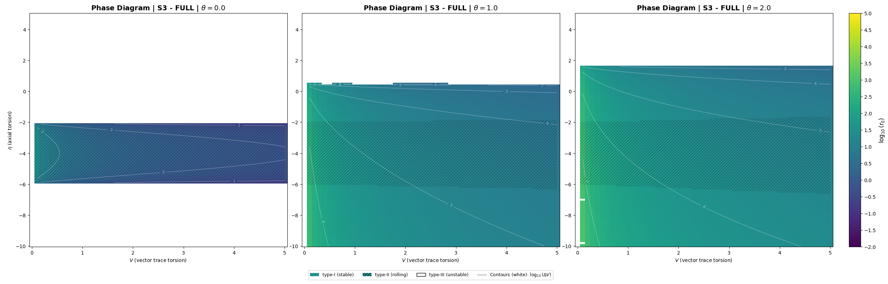
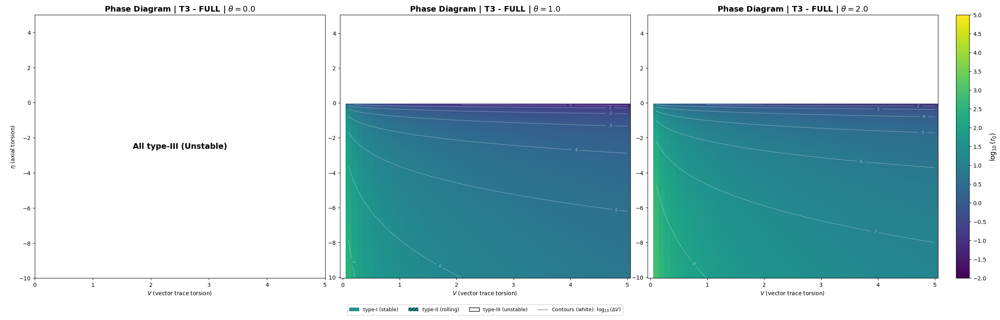
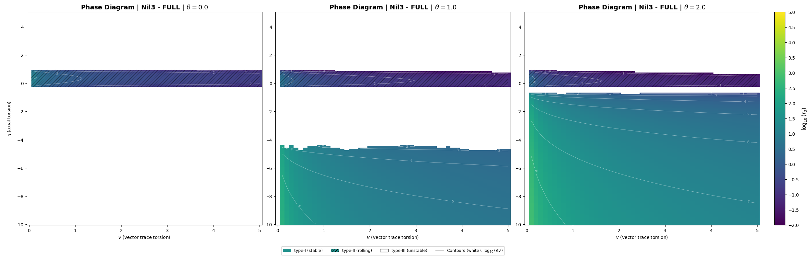

## 4. 数値結果：相図と相境界（Numerical results: phase diagrams and boundaries）

本節では、Sec. 3 で導出した有効ポテンシャルに対する数値スキャンの結果を提示する。まず Type 分類の判定手順と相図の読み方を説明し、続いて各トポロジーの相図を示す。相境界の形成機構や幾何学的解釈は Sec. 5 で議論する。

### 4.1 Type 分類の判定手順

#### 4.1.1 探索領域と数値手法

各パラメータ点 $(V, \eta, \theta_{\mathrm{NY}})$ に対し、 $r \in [r_{\min}, r_{\max}] = [0.01, 10^6]$ の範囲で $V_{\mathrm{eff}}(r)$ の極値を数値探索する。極値探索には Brent 法（scipy.optimize.minimize\_scalar）を使用し、曲率条件 $d^2V/dr^2 > 0$ を数値微分で検証する。

#### 4.1.2 Type 判定基準

Sec. 2.6 の定義に基づき、以下の基準で Type を判定する：

- **Type I（障壁付き安定）**：許容領域内に局所極小 $r_0$ が存在し、 $r \to 0$ 方向に障壁（ $\Delta V > 0$ ）が存在する
- **Type II（rolling）**：許容領域内に局所極小 $r_0$ が存在するが、 $r \to 0$ 方向に障壁がない（ $dV_{\mathrm{eff}}/dr|_{r \to 0^+} < 0$ ）
- **Type III（不安定）**：許容領域内に安定な局所極小が存在しない、または探索が境界（ $r_{\min}$ または $r_{\max}$ ）に到達

#### 4.1.3 スキャン解像度

スキャン解像度は $V$ 方向 51 点、 $\eta$ 方向 151 点、 $\theta_{\mathrm{NY}}$ 方向 51 点（範囲[0, 5]）であり、総計約 39 万点/トポロジーの評価を行った。なお、本論文では $\theta_{\mathrm{NY}} \lesssim 2$ の範囲の結果を主に提示する。境界位置の不確かさはグリッド間隔程度（ $\Delta\eta \approx 0.1$, $\Delta V \approx 0.1$ ）である。

### 4.2 相図の読み方

本論文の相図では、 $(V, \eta)$ 平面上に Type 分類を以下の視覚的規約で表示する：

- **色付き領域（ハッチングなし）**：Type I（障壁付き安定井戸）
- **色付き領域（ハッチングあり）**：Type II（rolling、障壁なし）
- **白色領域**：Type III（不安定／境界張り付き）

色のグラデーションは安定半径 $r_0$ の対数値 $\log_{10}(r_0)$ を表し、紫（小）から黄（大）へと変化する。白い等高線は障壁高／井戸深さ $\Delta V$ の対数値 $\log_{10}(\Delta V)$ を示す。

### 4.3 トポロジー別相図：FULL variant

#### 4.3.1 $S^3 \times S^1$

Fig.9 に $S^3$-FULL の相図を $\theta_{\mathrm{NY}} = 0, 1, 2$ について示す。

#### Fig.9: Phase Diagram: $S^3 \times S^1$ ($\theta_{\mathrm{NY}} = 0, 1, 2$ )

##### $\theta_{\mathrm{NY}} = 0$ の場合：
- $\eta \gtrsim -2$：Type III（白）が支配的
- $-6 \lesssim \eta \lesssim -2$：Type II（ハッチング）の帯状領域
- $\eta \lesssim -6$：再び Type III

##### $\theta_{\mathrm{NY}} = 1$ の場合：
- $\eta \gtrsim 0.5$：Type III（白）
- $-2 \lesssim \eta \lesssim 0.5$：Type I（ハッチングなし）
- $-6 \lesssim \eta \lesssim -2$：Type II（ハッチング）の帯状領域
- $\eta \lesssim -6$：Type I（ハッチングなし）が再出現

##### $\theta_{\mathrm{NY}} = 2$ の場合：
- 安定領域（Type I + II）が $\eta > 0$ 方向へ拡大
- I/III 境界が $\eta \approx 2$ 付近まで移動
- Type II 帯も拡大

##### 主要な観察：
1. $\theta_{\mathrm{NY}} = 0$ : Type II の主バンドのみ
2. $\theta_{\mathrm{NY}} > 0$ : Type I 領域が出現・拡大
3. $\eta \to -\eta$ 対称性は破れている

#### 4.3.2 $T^3 \times S^1$

Fig.10 に $T^3$-FULL の相図を $\theta_{\mathrm{NY}} = 0, 1, 2$ について示す。

#### Fig.10: Phase Diagram: $T^3 \times S^1$ ($\theta_{\mathrm{NY}} = 0, 1, 2$ )

##### $\theta_{\mathrm{NY}} = 0$ の場合：
- 全領域が Type III（単調増加）
- 安定な極小は存在しない

##### $\theta_{\mathrm{NY}} = 1$ の場合：
- $\eta < 0$ の広い領域に Type I（安定井戸）が出現
- $\eta \gtrsim 0$ は全域 Type III

##### $\theta_{\mathrm{NY}} = 2$ の場合：
- Type I 領域がさらに拡大
- $r_0$ の等高線が $\eta$ 負方向に伸長

##### 主要な観察：
1. $\theta_{\mathrm{NY}} = 0$：全領域 Type III
2. $\theta_{\mathrm{NY}} > 0$：Type I が出現
3. $\eta \to -\eta$ 対称性は破れている

#### 4.3.3 $Nil^3 \times S^1$

Fig.11 に $Nil^3$-FULL の相図を $\theta_{\mathrm{NY}} = 0, 1, 2$ について示す。

#### Fig.11: Phase Diagram: $Nil^3 \times S^1$ ($\theta_{\mathrm{NY}} = 0, 1, 2$ )

##### $\theta_{\mathrm{NY}} = 0$ の場合：
- $-0.3 \lesssim \eta \lesssim 1$：狭い安定バンド（Type II）
- $\eta < -0.3$ および $\eta > 1$：Type III（白）がほぼ全域

##### $\theta_{\mathrm{NY}} = 1$ の場合：
- 主バンド（ $-0.3 < \eta < 1$ ）は維持
- $\eta \lesssim -4$ に**分離した安定領域（Type I）** が出現
- 主バンドと分離した安定領域は Type III 領域で隔てられている

##### $\theta_{\mathrm{NY}} = 2$ の場合：
- 下方の安定領域が拡大し、 $\eta \lesssim -0.5$ に広く分布
- 主バンド（ $-0.3 < \eta < 1$ ）の幅は、 $V$ の大きな領域では漸減する

##### 主要な観察：
1. $\theta_{\mathrm{NY}} = 0$ : Type II の主バンドのみ
2. $\theta_{\mathrm{NY}} > 0$ : Type I 領域が出現・拡大
3. $\eta \to -\eta$ 対称性は破れている

### 4.4 $\theta_{\mathrm{NY}}$ 依存性の要約

Table 1 に、各トポロジーにおける相境界の $\theta_{\mathrm{NY}}$ 依存性を要約する。

#### Table 1- $S^3$ : 相境界位置の $\theta_{\mathrm{NY}}$ 依存性（FULL variant）

| Type I/II/III | $\theta_{\mathrm{NY}} = 0$ | $\theta_{\mathrm{NY}} = 1$ | $\theta_{\mathrm{NY}} = 2$ |
|-----------|-------------|-------------|-------------|
| Type I 領域 | なし | $\eta < -6$, $-2 < \eta < 0.5$  | 拡大 |
| Type II (主バンド) | $-6 \lesssim \eta \lesssim -2$ | $-6 \lesssim \eta \lesssim -2$ | $-6 \lesssim \eta \lesssim -2$ |
| Type III 領域 | $\eta \lesssim -6$, $-2 \lesssim \eta$ | $0.5 \lesssim \eta$  | 縮小 |

#### Table 1- $T^3$ : 相境界位置の $\theta_{\mathrm{NY}}$ 依存性（FULL variant）

| Type I/II/III | $\theta_{\mathrm{NY}} = 0$ | $\theta_{\mathrm{NY}} = 1$ | $\theta_{\mathrm{NY}} = 2$ |
|-----------|-------------|-------------|-------------|
| Type I 領域 | なし | $\eta \lesssim 0$ | $\eta \lesssim 0$ |
| Type II 領域 | なし | なし |　なし |
| Type III 領域 | 全域 | $0 \lesssim \eta$ | $0 \lesssim \eta$ |

#### Table 1- $Nil^3$ : 相境界位置の $\theta_{\mathrm{NY}}$ 依存性（FULL variant）

| Type I/II/III | $\theta_{\mathrm{NY}} = 0$ | $\theta_{\mathrm{NY}} = 1$ | $\theta_{\mathrm{NY}} = 2$ |
|-----------|-------------|-------------|-------------|
| Type I 領域 |  なし | $\eta \lesssim -4$ | $\eta < -0.5$ |
| Type II (主バンド) | $-0.3 \lesssim \eta \lesssim 1$ | $-0.3 \lesssim \eta \lesssim 1$ | $-0.3 \lesssim \eta \lesssim 1$ |
| Type III 領域 | $\eta \lesssim -0.3$, $1 \lesssim \eta$ | $-4 \lesssim \eta \lesssim -0.3$, $1 \lesssim \eta$  | $-0.5 \lesssim \eta \lesssim -0.3$, $1 \lesssim \eta$ |

#### 主要な観察：
1. **$S^3$** ： $\theta_{\mathrm{NY}}$ に対して強い依存性を示し、安定領域が $\eta > 0$ に拡大する
2. **$T^3$** ： $\theta_{\mathrm{NY}} \lesssim 0.9$ では全域 Type III だが、 $\theta_{\mathrm{NY}} \gtrsim 0.9$ で $\eta < 0$ に Type I が出現
3. **$Nil^3$** ：主バンドは $\theta_{\mathrm{NY}}$ に鈍感だが、 $\eta < 0$ の安定領域は $\theta_{\mathrm{NY}}$ とともに成長

### 4.5 TT/REE variant との比較

Fig.12 は、 $\theta_{\mathrm{NY}} = 1.0$ における3トポロジー × 3 variant の相図マトリクスである。

#### Fig.12: Phase Diagram Matrix: $\theta_{\mathrm{NY}} = 1.0$

#### $S^3$：
- FULL, TT, REE で相境界の位置が明確に異なる
- FULL が最も広い安定領域を持つ
- TT と REE は FULL より狭い安定領域

#### $T^3$：
- FULL と REE は完全に同一の相図（ $N_{\mathrm{FULL}} = N_{\mathrm{REE}}$ のため）
- TT は係数が2倍異なるが、相境界位置は類似
- $\theta_{\mathrm{NY}} \gtrsim 0.9$ では全 variant で $\eta < 0$ に Type I 領域が出現

#### $Nil^3$：
- 3 variant で中程度の差異が観測される
- 主バンドの位置はほぼ同一
- 下方の安定領域の形状・範囲が異なる

