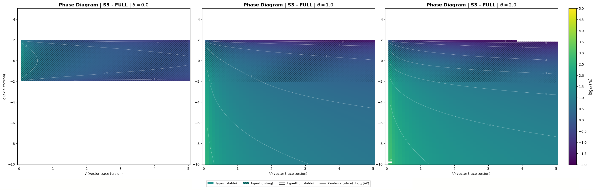
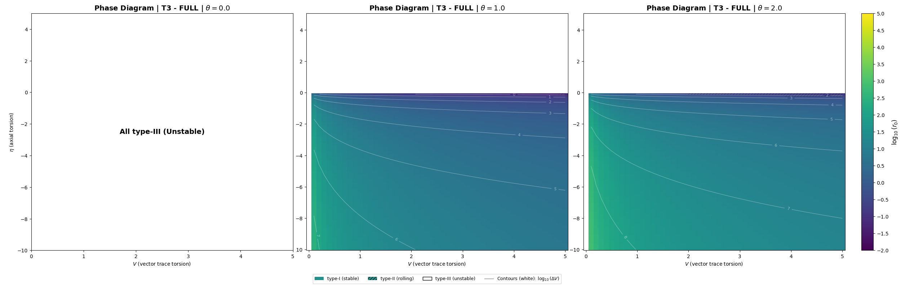
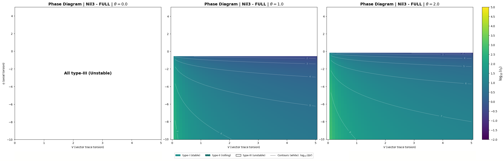
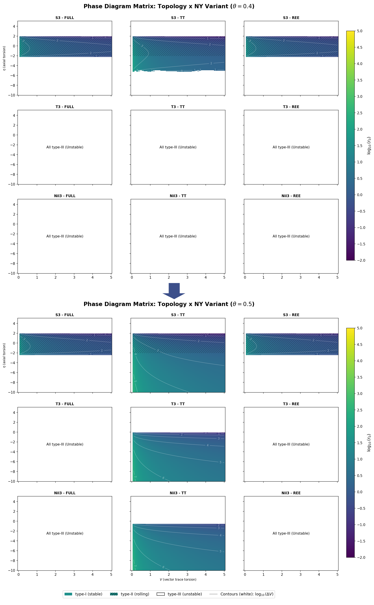
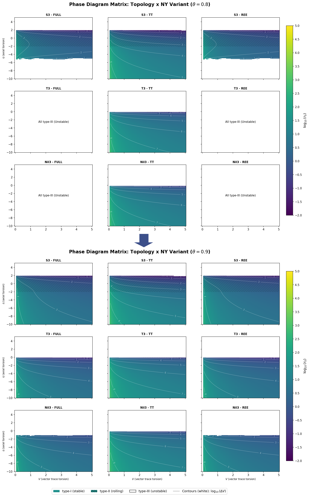

## 4. 数値結果：相図と相境界（Numerical Results: Phase Diagrams and Boundaries）

本節では、Sec. 3 で導出した有効ポテンシャルの数値スキャン結果を示す。まず Type 分類手順と相図の読み方を説明し、その後に各トポロジーの相図を提示する。相境界が生まれる機構の解釈は Sec. 5 で扱う。

### 4.1 Type 分類手順

#### 4.1.1 探索領域と数値法

各パラメータ点 $(V,\eta,\theta_{\mathrm{NY}})$ について、  
$r \in [r_{\min}, r_{\max}] = [0.01, 10^6]$ で $V_{\mathrm{eff}}(r)$ の極値を探索する。  
極値探索には Brent 法（`scipy.optimize.minimize_scalar`）を用い、曲率条件 $d^2V/dr^2 > 0$ を数値微分で確認する。

#### 4.1.2 Type 判定基準

Sec. 2.6 の定義に基づき、以下で判定する。

- Type I（障壁付き安定）：許容領域内に局所極小 $r_0$ が存在し、 $r \to 0$ 方向に障壁（ $\Delta V > 0$ ）がある
- Type II（rolling）：許容領域内に局所極小 $r_0$ はあるが、 $r \to 0$ 方向に障壁がない（ $dV_{\mathrm{eff}}/dr|_{r\to0^+}<0$ ）
- Type III（不安定）：許容領域内に安定な局所極小がない、または探索が境界（ $r_{\min}$ または $r_{\max}$ ）に張り付く

#### 4.1.3 スキャン解像度

$V$ 方向 51 点、 $\eta$ 方向 151 点、 $\theta_{\mathrm{NY}}$ 方向 51 点（ $[0,5]$ ）で、1トポロジーあたり約 39 万点を評価した。  
本論文では主に $\theta_{\mathrm{NY}} \lesssim 2$ の結果を提示する。  
境界位置の不確かさはグリッド間隔程度（ $\Delta\eta \approx 0.1,\ \Delta V \approx 0.1$ ）。

### 4.2 相図の読み方

本論文の相図では、 $(V,\eta)$ 平面上の Type 分類を次で可視化する。

- 色付き領域（ハッチなし）：Type I（障壁付き安定井戸）
- 色付き領域（ハッチあり）：Type II（rolling、障壁なし）
- 白色領域：Type III（不安定／境界張り付き）

色のグラデーションは安定半径 $\log_{10}(r_0)$（紫:小〜黄:大）を表し、白色等高線は $\log_{10}(\Delta V)$ を表す。

### 4.3 トポロジー別相図（FULL variant）

#### 4.3.1 $S^3 \times S^1$

#### Fig.9: Phase Diagram: $S^3 \times S^1$ ($\theta_{\mathrm{NY}}=0,1,2$)

**$\theta_{\mathrm{NY}}=0$**

- $|\eta| \gtrsim 2$：Type III（白）
- $|\eta| \lesssim 2$：Type II（ハッチ）の帯
- この帯は $C=9\eta^2-36<0$ と一致

**$\theta_{\mathrm{NY}}>0$**

- 大きな $|\eta|$ 領域で Type I が出現
- 中央帯 $|\eta| \lesssim 2$ には Type II が残る
- $\eta$ を $-3 \to 0 \to +3$ と走査すると Type I $\to$ Type II $\to$ Type III の遷移が現れる
- $B$ 項の効果で $\eta \to -\eta$ 対称性は破れる

**主要点**

1. $\theta_{\mathrm{NY}}=0$ では安定性（Type II）は純粋に幾何学起源（$C<0$）
2. $\theta_{\mathrm{NY}}>0$ では中央帯外・主に $\eta<0$ 側で Type I が形成される
3. 相境界は一貫して $C=0$（$\eta=\pm2$）に整合

#### 4.3.2 $T^3 \times S^1$

#### Fig.10: Phase Diagram: $T^3 \times S^1$ ($\theta_{\mathrm{NY}}=0,1,2$)

**$\theta_{\mathrm{NY}}=0$**

- 全域 Type III（単調増加）
- 安定極小なし

**$\theta_{\mathrm{NY}}>0$**

- $\eta<0$（ $B<0$ ）で Type I が出現
- $\eta \gtrsim 0$ は全域 Type III

**主要点**

1. $\theta_{\mathrm{NY}}=0$：幾何学的に不安定（全域 Type III）
2. $\theta_{\mathrm{NY}}>0$：torsion 起源で Type I が出現
3. $\eta \to -\eta$ 対称性が破れる

#### 4.3.3 $Nil^3 \times S^1$

#### Fig.11: Phase Diagram: $Nil^3 \times S^1$ ($\theta_{\mathrm{NY}}=0,1,2$)

**$\theta_{\mathrm{NY}}=0$**

- 全域 Type III
- $C=36\eta^2+3>0$ が常に正で、幾何学だけでは極小ができない

**$\theta_{\mathrm{NY}}>0$**

- $\eta<0$（ $B<0$ ）に Type I が出現
- $\eta \gtrsim 0$ は Type III
- $\eta \approx 0$ 近傍では、負側でも Type III の「漏れ」が残る（ $B^2\propto\eta^2$ の減少が速く、安定条件を満たしにくい）

**主要点**

1. $\theta_{\mathrm{NY}}=0$：幾何学だけでは不安定
2. $\theta_{\mathrm{NY}}>0$：torsion で安定化するが、 $\eta\approx0$ では負曲率由来の抑制が効く
3. $\eta \to -\eta$ 対称性が破れる

### 4.4 $\theta_{\mathrm{NY}}$ 依存性の要約

#### Table: $S^3$ の相境界（FULL）

| Type | $\theta_{\mathrm{NY}}=0$ | $\theta_{\mathrm{NY}}=1$ | $\theta_{\mathrm{NY}}=2$ |
|---|---|---|---|
| Type I | なし | $\eta<-2$ | $\eta<-2$ |
| Type II（主帯） | $-2<\eta<2$ | $-2<\eta<2$ | $-2<\eta<2$ |
| Type III | $\eta<-2,\ \eta>2$ | $\eta>2$ | $\eta>2$ |

#### Table: $T^3$ の相境界（FULL）

| Type | $\theta_{\mathrm{NY}}=0$ | $\theta_{\mathrm{NY}}=1$ | $\theta_{\mathrm{NY}}=2$ |
|---|---|---|---|
| Type I | なし | $\eta\lesssim0$ | $\eta\lesssim0$ |
| Type II | なし | なし | なし |
| Type III | 全域 | $0\lesssim\eta$ | $0\lesssim\eta$ |

#### Table: $Nil^3$ の相境界（FULL）

| Type | $\theta_{\mathrm{NY}}=0$ | $\theta_{\mathrm{NY}}=1$ | $\theta_{\mathrm{NY}}=2$ |
|---|---|---|---|
| Type I | なし | $\eta\lesssim-0.5$ | $\eta\lesssim-0.3$ |
| Type II | なし | なし | なし |
| Type III | 全域 | $\eta\gtrsim-0.5$ | $\eta\gtrsim-0.3$ |

**主要点**

1. $S^3$ は $\theta_{\mathrm{NY}}$ 依存性が強く、主に $\eta<-2$ 側で安定領域が拡大
2. $T^3$ は $\theta_{\mathrm{NY}}\lesssim0.9$ で全域 Type III、 $\theta_{\mathrm{NY}}\gtrsim0.9$ で $\eta<0$ に Type I が出現
3. $Nil^3$ は $T^3$ に近いが、 $\eta\approx0$ 近傍で負曲率抑制が残る

### 4.5 TT/REE variant との比較

この小節では、3トポロジー（ $S^3,T^3,Nil^3$ ）×3 variant（FULL, TT, REE）の比較から、 $\theta_{\mathrm{NY}}$ 増加時の相構造の差を確認する。

#### Fig.12: Phase Diagram Matrix: $\theta_{\mathrm{NY}}=0.4 \to 0.5$

**TT が先に安定化する（0.5 付近）**

- $\theta_{\mathrm{NY}}=0.5$ で、TT は FULL/REE より先に Type I を出す
- $S^3$ では $\theta_{\mathrm{NY}}<0.5$ でも安定領域はあるが、0.5 で TT の Type I 領域が大きく拡張
- $T^3,\ Nil^3$ では $\theta_{\mathrm{NY}}<0.5$ で全域 Type III のままだが、0.5 で TT が最初に Type I を形成
- これは $B_{\mathrm{TT}}=2B_{\mathrm{FULL}}$ により、安定化条件をより小さい $\theta_{\mathrm{NY}}$ で満たしやすいため

#### Fig.13: Phase Diagram Matrix: $\theta_{\mathrm{NY}}=0.8 \to 0.9$

**FULL/REE の安定化（0.9 付近）**

- $T^3,\ Nil^3$ の FULL/REE は $\theta_{\mathrm{NY}}<0.9$ で Type III のまま
- $\theta_{\mathrm{NY}}=0.9$ で両者が同時に Type I を出す（TT が先に越えた閾値に到達）
- $Nil^3$ では TT の安定領域は $\eta\approx0$ 近傍まで伸びるが、FULL/REE には Type III の漏れが残る
- 全トポロジーで FULL と REE の相図形状は一致し、同じ有効構造へ収束していることを示す
