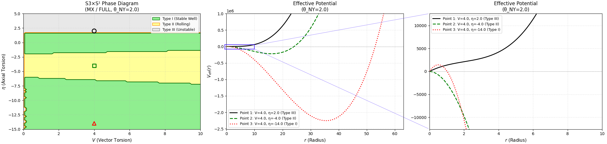
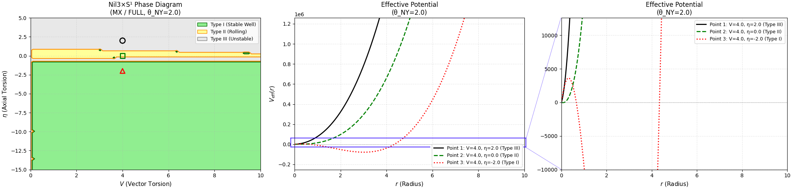

## 5. 相構造の機構と解釈（Mechanisms and interpretation）

本節では、Sec. 4 で提示した相図の特徴を、有効ポテンシャル $V_{\mathrm{eff}}(r)$ の解析的構造に基づいて解釈する。

### 5.1 Type 遷移における $V_{\mathrm{eff}}(r)$ の形状変化

#### 5.1.1 Type III → Type II 遷移（井戸の出現）

Type III から Type II への遷移は、 $V_{\mathrm{eff}}(r)$ に局所極小が出現することに対応する。

$S^3$-FULL において $\theta_{\mathrm{NY}} = 0$, $V = 2$ を固定し、 $\eta$ を $0$ から $-2$ へ変化させた場合を考える：

- **$\eta = 0$（Type III）**： $V_{\mathrm{eff}}(r)$ は単調増加し、許容領域内に極小を持たない
- **$\eta = -2$（Type II）**： $V_{\mathrm{eff}}(r)$ に局所極小が出現。ただし $r \to 0$ 方向に障壁はなく、原点近傍で $dV_{\mathrm{eff}}/dr < 0$

この遷移は、Sec. 3 で導出した有効ポテンシャルの構造から理解できる。 $S^3$ の場合：

$$
V_{\mathrm{eff}}(r) \propto r \left[ V^2 r^2 + B r + C \right]
$$

ここで $B = 6V\kappa^2\theta_{\mathrm{NY}}(\eta - 4)$ 、 $C = 9\eta^2 + 72\eta + 108 = 9(\eta + 4)^2 - 36$ である。

$\theta_{\mathrm{NY}} = 0$ では $B = 0$ となり、極小の存在は $r$ の係数 $C$ の符号のみで決まる。 $C < 0$ となる $\eta \in (-8, 0)$ の範囲で極小が出現しうるが、 $r \to 0$ での振る舞いにより Type II となる。

#### 5.1.2 Type II → Type I 遷移（障壁の形成）

Type II から Type I への遷移は、 $r \to 0$ 方向に障壁が形成されることに対応する。

この遷移は、原点近傍における $V_{\mathrm{eff}}(r)$ の勾配の符号変化として特徴づけられる：

$$
\frac{dV_{\mathrm{eff}}}{dr}\bigg|_{r \to 0^+} \quad \begin{aligned} < 0 & \text{(Type II: rolling)} \\ > 0 & \text{(Type I: barrier)} \end{aligned}
$$

$S^3$ の有効ポテンシャルを微分すると：

$$\frac{dV_{\mathrm{eff}}}{dr} \propto 3V^2 r^2 + 2B r + C$$

$r \to 0$ では $dV_{\mathrm{eff}}/dr \propto C$ となるため、**$C$ の符号が Type I/II を決定する**：
- $C > 0$ ： $dV_{\mathrm{eff}}/dr|_{r=0} > 0$ → Type I
- $C < 0$ ： $dV_{\mathrm{eff}}/dr|_{r=0} < 0$ → Type II

$S^3$ では $C = 9(\eta + 4)^2 - 36$ であり、 $C = 0$ となるのは $\eta = -4 \pm 2$ 、すなわち $\eta = -2$ または $\eta = -6$ である。これが I/II 境界の位置に対応する。

#### 5.1.3 Type I → Type II → Type I 再遷移

$S^3$-FULL において $\theta_{\mathrm{NY}} \geq 1$ で観測される「Type I → Type II → Type I」の再遷移は、 $C(\eta) = 9(\eta + 4)^2 - 36$ が2次関数であることから理解できる。

$C(\eta)$ は $\eta = -4$ で最小値 $-36$ をとり、 $\eta = -2$ および $\eta = -6$ で $C = 0$ となる。したがって：

- $\eta > -2$ ： $C > 0$ → Type I（または Type III）
- $-6 < \eta < -2$ ： $C < 0$ → Type II
- $\eta < -6$ ： $C > 0$ → Type I

この構造により、 $\eta$ を正から負へ変化させると Type I → Type II → Type I という再遷移が生じる。

### 5.2 $S^3$ の複雑な相構造の起源

#### Fig.13: Phase - Potential: $S^3 \times S^1$  ($\theta_{\mathrm{NY}} = 2$ )

##### 観察される特徴：
1. $\theta_{\mathrm{NY}} = 0$ では Type II の帯状領域のみで、Type I が存在しない
2. $\theta_{\mathrm{NY}} > 0$ で Fig.13 のように Type I 帯が出現し、 $\theta_{\mathrm{NY}}$ とともに拡大
3. Type I → Type II → Type I という「再遷移」構造が $\theta_{\mathrm{NY}} \geq 1$ で観測される
4. 安定半径 $r_0$ は $\eta$ が負に大きいほど増大する傾向
5. $\eta \to -\eta$ 対称性は破れている

$S^3$ が複雑な相構造を示す理由は、2つの要因の競合による：

#### 5.2.1 係数 $B$ の役割（ $\theta_{\mathrm{NY}}$ 依存性）

$r^2$ 項の係数 $B = 6V\kappa^2\theta_{\mathrm{NY}}(\eta - 4)$ は、 $\theta_{\mathrm{NY}} > 0$ の場合に以下の効果を持つ：

- $\eta < 4$ で $B < 0$ ： $V_{\mathrm{eff}}(r)$ に負の寄与を加え、極小形成を促進
- $|B|$ は $\theta_{\mathrm{NY}}$ に比例して増大

$\theta_{\mathrm{NY}} = 0$ では $B = 0$ であり、極小の存在は $C$ のみで決まる。 $\theta_{\mathrm{NY}} > 0$ になると $B$ の寄与が加わり、 $C > 0$ の領域でも極小が形成されうる。これが「 $\theta_{\mathrm{NY}}$ 増加による安定領域の拡大」の機構である。

#### 5.2.2 係数 $C$ の役割（Type I/II 境界）

 $r$ の係数 $C = 9(\eta + 4)^2 - 36$ は $r \to 0$ での振る舞いを支配し、Type I/II を決定する。

重要な点として、 $C$ の式に現れる $(\eta + 4)$ という因子は、 $S^3$ の背景曲率 $R_{\mathrm{LC}} = 24/r^2$ との結合を反映している。Sec. 3 で見たように、 $N_{\mathrm{REE}} = -2V(\eta + 4)/r$ に $(\eta + 4)$ が現れており、これが $C$ に伝播する。

#### 5.2.3 因子 $(\eta - 4)$ の起源

FULL variant における $B \propto (\eta - 4)$ という因子は、 $N_{\mathrm{FULL}} = N_{\mathrm{TT}} - N_{\mathrm{REE}} = 2V(4 - \eta)/r$ から直接導かれる。

この因子は TT（ $B \propto \eta$ ）とも REE（ $B \propto \eta + 4$ ）とも異なり、FULL 固有のものである。 $(\eta - 4)$ により、 $\eta < 4$ の広い範囲で $B < 0$ となり、FULL が $\eta > 0$ にも安定領域を持つ理由となっている。

### 5.3 $T^3$ の相構造：$\theta_{\mathrm{NY}}$ 閾値と $\eta$ 非対称性

#### Fig.14: Phase - Potential: $T^3 \times S^1$  ($\theta_{\mathrm{NY}} = 2$ )

##### 観察される特徴：
- $\theta_{\mathrm{NY}} \lesssim 0.9$：全領域 Type III
- $\theta_{\mathrm{NY}} \gtrsim 0.9$：Fig.14に示すように、 $\eta < 0$ に Type I 出現
- $\eta \to -\eta$ 対称性は破れている（ $\theta_{\mathrm{NY}} > 0$ で顕著）

等方的設定 $R_1 = R_2 = R_3 = r$ における $T^3$ の相構造を解析する。

#### 5.3.1 有効ポテンシャルの構造

$T^3$ の有効ポテンシャルは：

$$V_{\mathrm{eff}}(r) \propto r \cdot \left[ V^2 r^2 + B r + C \right]$$

ここで $B = 6V\eta\kappa^2\theta_{\mathrm{NY}}$ 、 $C = 9\eta^2$ である。 $S^3$ と同様の $r^3 + r^2 + r$ 型構造を持つ。

#### 5.3.2 $\theta_{\mathrm{NY}} = 0$ での Type III 全域

$\theta_{\mathrm{NY}} = 0$ では $B = 0$ となり：

$$V_{\mathrm{eff}}(r) \propto r (V^2 r^2 + 9\eta^2)$$

$C = 9\eta^2 \geq 0$ かつ $V^2 > 0$ のため、括弧内は常に正であり、 $V_{\mathrm{eff}}(r)$ は $r > 0$ で単調増加となる。したがって全パラメータ領域で Type III（不安定）となる。

これは $T^3$ の平坦性（ $R_{\mathrm{LC}} = 0$ ）に起因する：背景曲率からの寄与がないため、 $r$ の係数 $C$ に $\eta$ の1次項が含まれず、 $C = 9\eta^2$ は常に非負となる。

#### 5.3.3 $\theta_{\mathrm{NY}} > 0$ での Type I 出現

$\theta_{\mathrm{NY}} > 0$ では $B = 6V\eta\kappa^2\theta_{\mathrm{NY}}$ が有効となる。

極小の存在条件は $dV_{\mathrm{eff}}/dr = 0$ が正の解を持つこと：

$$3V^2 r^2 + 2Br + C = 0$$

判別式 $D = 4B^2 - 12V^2 C = 4(B^2 - 3V^2 C)$ が正、かつ解が正となる条件は：

$$B < 0 \quad \text{かつ} \quad B^2 > 3V^2 C$$

$B < 0$ となるのは $\eta < 0$（ $\theta_{\mathrm{NY}} > 0$ の場合）であり、第二の条件は：

$$36V^2\eta^2\kappa^4\theta_{\mathrm{NY}}^2 > 27V^2\eta^2$$

すなわち $\theta_{\mathrm{NY}} > \sqrt{3}/2\kappa^2 \approx 0.87$（ $\kappa = 1$ の場合）で満たされる。

これが「 $\theta_{\mathrm{NY}} \approx 0.9$ で Type I が出現」という観測結果の解析的説明である。

#### 5.3.4 $\eta \to -\eta$ 対称性の破れ

$T^3$ では $B = 6V\eta\kappa^2\theta_{\mathrm{NY}}$ が $\eta$ に線形であるため、 $\eta \to -\eta$ で $B \to -B$ となる。

- $\eta < 0, \theta_{\mathrm{NY}} > 0$ ： $B < 0$ （極小形成に寄与）
- $\eta > 0, \theta_{\mathrm{NY}} > 0$ ： $B > 0$ （極小形成を妨げる）

したがって、 $\theta_{\mathrm{NY}} > 0$ では安定領域は $\eta < 0$ 側にのみ出現し、 $\eta \to -\eta$ 対称性は破れる。

この非対称性は $S^3$（ $B \propto (\eta - 4)$ ）や $Nil^3$（ $B \propto (3\eta + 1)$ ）でも見られるが、 $T^3$ では $C = 9\eta^2$ が $\eta$ に対称であるため、非対称性は純粋に $B$ 項のみに由来する点が特徴的である。

### 5.4 $Nil^3$ のバンド＋安定領域構造の条件

#### Fig.15: Phase - Potential: $Nil^3 \times S^1$  ($\theta_{\mathrm{NY}} = 2$ )

##### 観察される特徴：
1. Fig.15 に示すように、Type II 領域が $-0.3 < \eta < 1$ の狭い主バンドに限定される
2. $\theta_{\mathrm{NY}} > 0$ で $\eta < 0$ 領域に分離したType I 領域が出現し、拡大する
3. $\eta \to -\eta$ 対称性は破れている

$Nil^3$ が狭い安定バンドと分離した安定領域を示す理由を解析する。

#### 5.4.1 狭い主バンドの起源

$Nil^3$ の有効ポテンシャルは：

$$V_{\mathrm{eff}}(r) \propto r \left[ 4V^2 r^2 + B r + C \right]$$

ここで $C = 36\eta^2 - 24\eta - 9 = 36(\eta - 1/3)^2 - 13$ である。

$C$ が負となる条件は $36(\eta - 1/3)^2 < 13$、すなわち：

$$\eta \in \left( \frac{1}{3} - \frac{\sqrt{13}}{6}, \frac{1}{3} + \frac{\sqrt{13}}{6} \right) \approx (-0.27, 0.93)$$

この狭い範囲でのみ $C < 0$ となり、安定な極小が形成されうる。これが「狭い主バンド」の起源である。

#### 5.4.2 分離した安定領域の出現条件

$\theta_{\mathrm{NY}} > 0$ で $\eta < 0$ 領域に出現する島は、係数 $B = 8V\kappa^2\theta_{\mathrm{NY}}(3\eta + 1)$ の効果による。

$\eta < -1/3$ では $B < 0$ となり、 $|B|$ が十分大きければ $C > 0$ の領域でも極小が形成されうる。具体的には、 $3V^2 r^2 + 2Br + C = 0$ が正の実数解を持つ条件：

$$B^2 > 3V^2 C$$

が満たされれば極小が存在する。 $\theta_{\mathrm{NY}}$ が増加すると $|B|$ が増大し、より広い $\eta$ 範囲でこの条件が満たされる。これが「 $\theta_{\mathrm{NY}}$ とともに安定領域が成長する」機構である。

#### 5.4.3 $\eta \to -\eta$ 対称性の破れ

$Nil^3$ では $C(\eta) = 36\eta^2 - 24\eta - 9$ に $\eta$ の1次項が含まれるため、 $\eta \to -\eta$ 対称性が破れている。これは $Nil^3$ の非等方的な構造定数を反映している。

### 5.5 TT/REE 診断：曲率結合の役割

FULL, TT, REE の比較から、相構造を駆動する寄与を同定する。

#### 5.5.1 $S^3$ ： $N_{\mathrm{REE}}$ の支配的役割

$S^3$ における3 variant の $r^2$ 項係数：

| Variant | $B$ の形 | $B < 0$ となる $\eta$ 範囲 |
|---------|---------|-------------------------|
| FULL | $\propto (\eta - 4)$ | $\eta < 4$ |
| TT | $\propto \eta$ | $\eta < 0$ |
| REE | $\propto (\eta + 4)$ | $\eta < -4$ |

FULL の $(\eta - 4)$ 因子は、 $N_{\mathrm{TT}}$ の $\eta$ 因子と $N_{\mathrm{REE}}$ の $(\eta + 4)$ 因子の組み合わせ $\eta - (\eta + 4) = -4$ から生じる追加的なシフトを反映している。

FULL が最も広い安定領域を持つのは、この因子により $B < 0$ となる $\eta$ 範囲が最大となるためである。

#### 5.5.2 $T^3$：曲率寄与の消失と NY 項の役割

$T^3$ では背景曲率 $R_{\mathrm{LC}} = 0$ であるため、 $N_{\mathrm{REE}}$ からの曲率結合項が消失する。その結果：
- $N_{\mathrm{FULL}} = N_{\mathrm{REE}} = -2V\eta/r$（完全に同一）
- TT は係数が2倍だが、相境界位置は類似

等方的設定では NY 項が $r^2$ に比例するため、 $\theta_{\mathrm{NY}} > 0$ で極小形成に寄与する。 $S^3$ と異なり $r$ の係数 $C = 9\eta^2$ が常に非負であるため、Type I 出現には $\theta_{\mathrm{NY}}$ が閾値（ $\approx 0.9$ ）を超える必要がある。

3 variant で相構造が類似するのは、曲率結合の欠如により variant 間の差異が係数の違いのみに限定されるためである。

#### 5.5.3 曲率結合の一般的役割

以上の比較から、相境界の $\theta_{\mathrm{NY}}$ 依存性は主に $N_{\mathrm{REE}}$ を通じた**背景曲率との結合**により駆動されることが示唆される：

| トポロジー | 背景曲率 $R_{\mathrm{LC}}$ | 曲率結合の強さ | $\theta_{\mathrm{NY}}$ 感度 |
|-----------|------------------------|--------------|-------------------------|
| $S^3$ | $+24/r^2$（正） | 強い | 高い |
| $T^3$ | $0$（平坦） | なし | 中程度（閾値あり） |
| $Nil^3$ | $-1/(2r^2)$（負） | 中程度 | 中程度 |

背景曲率が大きいほど $N_{\mathrm{REE}}$ の寄与が顕著となり、 $\theta_{\mathrm{NY}}$ に対する相構造の感度が高くなる。

注： $T^3$ は背景曲率がゼロであるにもかかわらず、等方的設定 $R_1 = R_2 = R_3 = r$ では NY 項が $r^2$ に比例する形で有効ポテンシャルに寄与するため、 $\theta_{\mathrm{NY}}$ 感度を持つ。ただし、 $r$ の係数 $C = 9\eta^2$ が常に非負であるため、Type I 出現には $\theta_{\mathrm{NY}} > 0.87$ という閾値が必要となる。

