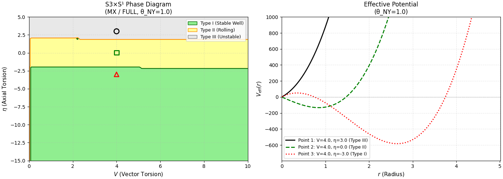
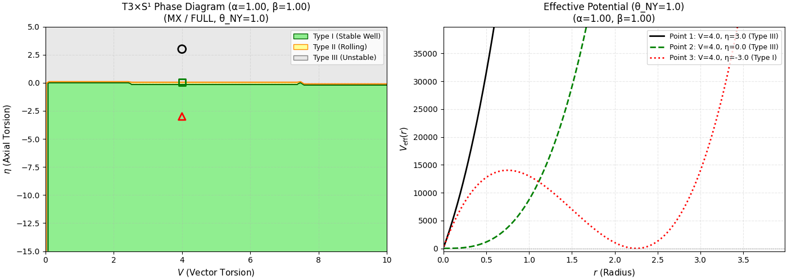
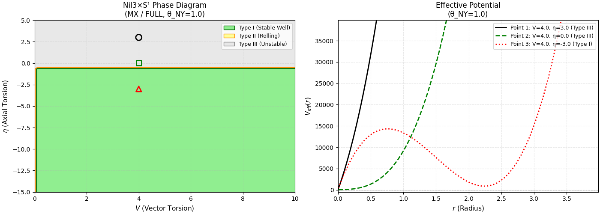

## 5. 相構造の機構と解釈（Mechanisms and Interpretation of Phase Structure）

本節では、Sec. 4 の相図で見えた特徴を、有効ポテンシャル $V_{\mathrm{eff}}(r)$ の解析構造から解釈する。

### 5.1 Type 遷移における $V_{\mathrm{eff}}(r)$ の形状変化

#### 5.1.1 Type III $\to$ Type II（井戸の出現）

Type III から Type II への遷移は、 $V_{\mathrm{eff}}(r)$ に局所極小が現れることに対応する。  
$S^3$-FULL で $\theta_{\mathrm{NY}}=0,\ V=4$ を固定し、 $\eta$ を $3 \to 0$ に変えると以下になる。

- $\eta=3$（Type III）：単調増加で極小なし
- $\eta=0$（Type II）：局所極小は出るが、 $r\to0$ 方向に障壁はなく rolling

$S^3$ では

$$
V_{\mathrm{eff}}(r)\propto r\left[V^2r^2+Br+C\right],
$$

$$
B=6V\eta\kappa^2\theta_{\mathrm{NY}},\qquad C=9\eta^2-36.
$$

$\theta_{\mathrm{NY}}=0$ では $B=0$ なので、極小の有無は $C$ の符号で決まる。  
$C<0$ となる $\eta\in(-2,2)$ で井戸が出現するが、原点近傍の振る舞いにより Type II になる。

#### 5.1.2 Type II $\to$ Type I（障壁形成）

Type II から Type I への遷移は、原点方向の障壁形成に対応する。

$$
\left.\frac{dV_{\mathrm{eff}}}{dr}\right|_{r\to0^+}
\begin{cases}
 < 0 & \text{Type II}\\
 \> 0 & \text{Type I}
\end{cases}
$$

また

$$
\frac{dV_{\mathrm{eff}}}{dr}\propto 3V^2r^2+2Br+C.
$$

$r\to0$ では $dV_{\mathrm{eff}}/dr\propto C$ なので、Type I/II は $C$ の符号で決まる。

- $C>0$：Type I
- $C<0$：Type II

$S^3$ では $C=9\eta^2-36$ だから、境界は $C=0 \Rightarrow \eta=\pm2$。

#### 5.1.3 Type I $\to$ Type II $\to$ Type III 遷移

$S^3$-FULL の遷移は、 $C(\eta)=9\eta^2-36$ が上に開く二次関数であることから理解できる。  
$\eta=0$ で最小値 $-36$、 $\eta=\pm2$ で $C=0$。

- $|\eta|>2$： $C>0$ （Type I もしくは Type III）
- $|\eta|<2$： $C<0$ （Type II）

このため、負側から正側へ $\eta$ を走査すると Type I $\to$ Type II $\to$ Type III の遷移が現れる。

### 5.2 $S^3$ 相構造の起源

#### Fig.14: Phase-Potential 対応（ $S^3 \times S^1,\ \theta_{\mathrm{NY}}=1$ ）

$S^3$ の相構造は、幾何係数 $C$ と torsion 係数 $B$ の競合で決まる。

#### 5.2.1 幾何係数 $C$ の役割

$C=9\eta^2-36$ には、正曲率（ $R_{\mathrm{LC}}=+24/r^2$ ）由来の負定数 $-36$ が入る。  
その結果、 $\eta\in(-2,2)$ で $C<0$ となり、 $\theta_{\mathrm{NY}}=0$ でも幾何学だけで井戸（Type II）が生まれる。

#### 5.2.2 torsion 係数 $B$ の役割

$\theta_{\mathrm{NY}}>0$ では

$$
B=6V\eta\kappa^2\theta_{\mathrm{NY}}
$$

が効き始める。

- 本来 $C>0$ で安定化しにくい領域でも、十分大きな負の $B$ が極小を作る
- これが Type I 領域の出現・拡大を説明する
- $B\propto\eta$ のため、安定化は主に $\eta<0$ 側で強くなる

### 5.3 $T^3$ 相構造： $\theta_{\mathrm{NY}}$ 閾値

#### Fig.15: Phase-Potential 対応（ $T^3 \times S^1,\ \theta_{\mathrm{NY}}=1$ ）

観測上、

- $\theta_{\mathrm{NY}}\lesssim0.9$：全域 Type III
- $\theta_{\mathrm{NY}}\gtrsim0.9$： $\eta<0$ に Type I 出現
- $\eta\to-\eta$ 対称性が破れる

等方設定 $R_1=R_2=R_3=r$ では

$$
V_{\mathrm{eff}}(r)\propto r\left[V^2r^2+Br+C\right],\quad
B=6V\eta\kappa^2\theta_{\mathrm{NY}},\quad
C=9\eta^2.
$$

$\theta_{\mathrm{NY}}=0$ なら $B=0$、 $C\ge0$ なので単調増加（全域 Type III）。

$\theta_{\mathrm{NY}}>0$ で Type I が出る条件は

$$
3V^2r^2+2Br+C=0
$$

が正の解を持つこと、すなわち

$$
B<0,\qquad B^2>3V^2C.
$$

後者は

$$
36V^2\eta^2\kappa^4\theta_{\mathrm{NY}}^2>27V^2\eta^2
\Rightarrow
\theta_{\mathrm{NY}}>\frac{\sqrt{3}}{2\kappa^2}\approx0.87\ (\kappa=1)
$$

となり、数値結果（約 0.9）を説明する。

### 5.4 $Nil^3$：負曲率による安定化抑制

#### Fig.16: Phase-Potential 対応（ $Nil^3 \times S^1,\ \theta_{\mathrm{NY}}=1$ ）

観測上は、

1. $\eta\approx0$ 近傍で Type I が抑制される
2. $\eta\to-\eta$ 対称性が破れる

$Nil^3$ の有効ポテンシャルは

$$
V_{\mathrm{eff}}(r)\propto r\left[4V^2r^2+Br+C\right],
$$

$$
B=24V\eta\kappa^2\theta_{\mathrm{NY}},\qquad C=36\eta^2+3>0.
$$

$C$ が常に正なので、安定化には $B$ の寄与（十分大きい負値）が必須。  
判別式条件は

$$
D=B^2-12V^2C>0.
$$

しかし $\eta\approx0$ では $B^2\propto\eta^2\to0$ 、一方で $C\to3$ の正値が残るため、条件を満たしにくい。  
これが「Type III の漏れ」の起源で、負曲率が弱 torsion 極限で安定化を妨げるという解釈に対応する。

### 5.5 variant 構成の一様性（FULL/TT/REE）

3 variant の NY 密度比較は以下。

| Variant | $N$ | $r^2$ 項係数 $B$ |
|---|---|---|
| FULL | $-2V\eta/r$ | $6V\eta\kappa^2\theta_{\mathrm{NY}}$ |
| REE | $-2V\eta/r$ | $6V\eta\kappa^2\theta_{\mathrm{NY}}$ |
| TT | $-4V\eta/r$ | $12V\eta\kappa^2\theta_{\mathrm{NY}}$ |

要点は次の通り。

- 3 variant とも機能形は $N\propto \eta/r$ で同型
- FULL と REE は一致し、TT は係数が 2 倍
- これは偶然ではなく、 $M_3\times S^1$ 積構造で $\varepsilon^{abcd}R^{\mathrm{LC}}_{abcd}=0$ となるため、REE のトポロジー依存 Levi-Civita 寄与が消えることに起因

したがって、位相依存は主に $C$ 側（Einstein-Hilbert 幾何項）に入り、NY 側は主として torsion 主導の安定化を担う。
