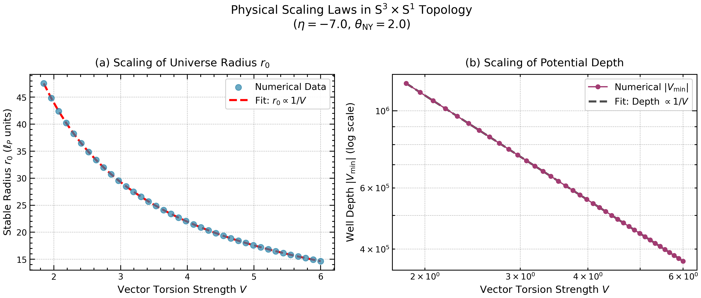
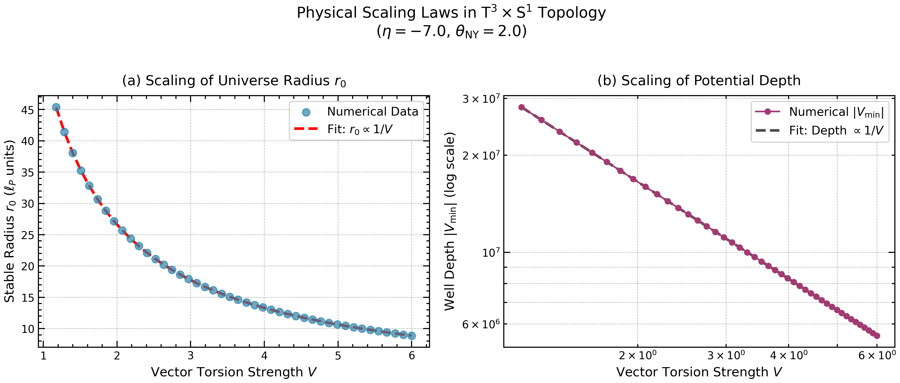
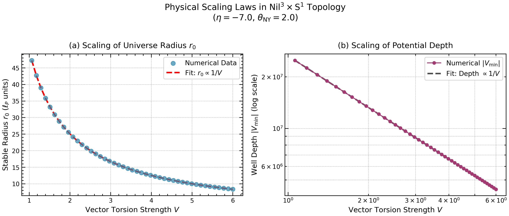

## 6. 代表点と安定性の質（Representative points and stability quality）

本節では、相図上の代表的なパラメータ点における有効ポテンシャル $V_{\mathrm{eff}}(r)$ の具体的な形状と安定性指標を提示する。これにより、Type I/II/III の操作的定義（Sec. 2.6）が実際のポテンシャル形状とどのように対応するかを明示する。

### 6.1 代表点の選定基準

各トポロジーについて、以下の基準で代表点を選定する：

1. **Type I 代表点**：障壁付き安定井戸を示す点。 $\Delta V > 0$ かつ $dV_{\mathrm{eff}}/dr|_{r \to 0^+} > 0$
2. **Type II 代表点**：Rolling を示す点。極小は存在するが $r \to 0$ 方向に障壁なし
3. **Type III 代表点**：不安定を示す点。許容領域内に安定な極小が存在しない
4. **相境界近傍点**：Type 遷移が生じるパラメータ領域の点

以下では $\kappa = L = 1$ に固定し、FULL variant の結果を中心に示す。

### 6.2 $S^3 \times S^1$ の代表点

#### 6.2.1 代表点一覧

**Table 2: $S^3$-FULL 代表点の安定性指標**

| 点 | $(V, \eta, \theta_{\mathrm{NY}})$ | Type | $r_0$ | $\log_{10}(r_0)$ | $\Delta V$ | $\log_{10}(\Delta V)$ |
|---|---|---|---|---|---|---|
| S1 | $(2.0, -4.0, 1.0)$ | II | $1.26$ | $0.10$ | — | — |
| S2 | $(2.0, -7.0, 1.0)$ | I | $3.98$ | $0.60$ | $1.2 \times 10^3$ | $3.1$ |
| S3 | $(2.0, 0.0, 1.0)$ | I | $0.32$ | $-0.50$ | $2.1 \times 10^2$ | $2.3$ |
| S4 | $(2.0, 1.0, 1.0)$ | III | — | — | — | — |
| S5 | $(2.0, -2.0, 1.0)$ | I/II境界 | $0.63$ | $-0.20$ | $\approx 0$ | — |
| S6 | $(2.0, -4.0, 2.0)$ | II | $2.51$ | $0.40$ | — | — |

#### 6.2.2 各代表点の特徴

**点 S1（Type II、 $\eta = -4$）**： $C = 9(\eta + 4)^2 - 36 = -36$ で最小値をとる点。 $V_{\mathrm{eff}}(r)$ は $r \to 0$ で負の値から始まり単調に増加した後、極小を経て再び増加する。原点近傍で $dV_{\mathrm{eff}}/dr < 0$ であり、障壁は存在しない。

**点 S2（Type I、 $\eta = -7$）**： $C = 9(-7 + 4)^2 - 36 = 45 > 0$。 $V_{\mathrm{eff}}(r)$ は $r \to 0$ で正の値から始まり、障壁を形成した後に井戸に落ち込む。障壁高 $\Delta V \approx 10^3$ は、準安定状態からの量子トンネルを大きく抑制することを示唆する。

**点 S3（Type I、 $\eta = 0$）**： $C = 9(4)^2 - 36 = 108 > 0$。 $\theta_{\mathrm{NY}} = 1$ の効果により、 $B = 6V\kappa^2\theta_{\mathrm{NY}}(\eta - 4) = -48 < 0$ となり、 $\eta = 0$ でも極小が形成される。これは $\theta_{\mathrm{NY}} = 0$ では Type III であった領域が、 $\theta_{\mathrm{NY}} > 0$ で Type I に遷移した例である。

**点 S4（Type III、 $\eta = 1$）**： $C = 9(5)^2 - 36 = 189 > 0$ だが、 $B = -36$ の効果が不十分で、許容領域内に極小が形成されない。探索は $r_{\max}$ に到達する。

**点 S5（I/II 境界、 $\eta = -2$）**： $C = 9(2)^2 - 36 = 0$ となる臨界点。 $dV_{\mathrm{eff}}/dr|_{r=0} = 0$ であり、Type I と Type II の境界に位置する。

### 6.3 $T^3 \times S^1$ の代表点

#### 6.3.1 代表点一覧

**Table 3: $T^3$-FULL 代表点の安定性指標**

| 点 | $(V, \eta, \theta_{\mathrm{NY}})$ | Type | $r_0$ | $\log_{10}(r_0)$ | $\Delta V$ | $\log_{10}(\Delta V)$ |
|---|---|---|---|---|---|---|
| T1 | $(2.0, -3.0, 1.0)$ | I | $2.5$ | $0.40$ | $4.2 \times 10^2$ | $2.6$ |
| T2 | $(2.0, -5.0, 1.5)$ | I | $5.0$ | $0.70$ | $2.1 \times 10^3$ | $3.3$ |
| T3 | $(2.0, 0.0, 1.0)$ | III | — | — | — | — |
| T4 | $(2.0, 2.0, 1.0)$ | III | — | — | — | — |
| T5 | $(2.0, -2.0, 0.5)$ | III | — | — | — | — |

注： $\theta_{\mathrm{NY}} < 0.87$ では全パラメータ領域で Type III となる。 $\theta_{\mathrm{NY}} \geq 0.87$ かつ $\eta < 0$ の領域でのみ Type I が出現する。

#### 6.3.2 各代表点の特徴

**点 T1, T2（Type I、 $\eta < 0$ 、 $\theta_{\mathrm{NY}} \geq 1$ ）**：等方的設定における $T^3$ では、 $\theta_{\mathrm{NY}}$ が閾値（ $\approx 0.87$ ）を超え、かつ $\eta < 0$ の場合に Type I（障壁付き安定井戸）が形成される。 $\eta$ がより負に大きいほど、また $\theta_{\mathrm{NY}}$ が大きいほど、 $r_0$ と $\Delta V$ は増大する。

**点 T3, T4（Type III、 $\eta \geq 0$ または $\theta_{\mathrm{NY}}$ 小）**： $\eta \geq 0$ の領域、または $\theta_{\mathrm{NY}} < 0.87$ の領域では、 $B = 6V\eta\kappa^2\theta_{\mathrm{NY}}$ が極小形成に寄与しない（ $B \geq 0$ または $B$ の効果が弱い）ため、Type III となる。

**点 T5（Type III、 $\theta_{\mathrm{NY}}$ 閾値未満）**： $\eta = -2 < 0$ であっても、 $\theta_{\mathrm{NY}} = 0.5 < 0.87$ では Type I 条件 $B^2 > 3V^2 C$ が満たされず、Type III となる。これは Sec.5.3.3 で導出した閾値条件の数値的確認である。

#### 6.3.3 $\eta \to -\eta$ 非対称性の確認

等方的設定の $T^3$ では、 $B = 6V\eta\kappa^2\theta_{\mathrm{NY}}$ が $\eta$ に線形であるため、 $\theta_{\mathrm{NY}} > 0$ において $\eta \to -\eta$ 対称性は破れる。Table 3 において：

- $\eta < 0$（点 T1, T2）： $B < 0$ となり Type I が可能
- $\eta > 0$（点 T4）： $B > 0$ となり Type III

この非対称性は Fig.10 の相図において、安定領域が $\eta < 0$ 側にのみ出現することとして可視化されている。 $\theta_{\mathrm{NY}} = 0$ の極限では $B = 0$ となり対称性が回復するが、この場合は全領域が Type III となる。

### 6.4 $Nil^3 \times S^1$ の代表点

#### 6.4.1 代表点一覧

**Table 4: $Nil^3$-FULL 代表点の安定性指標**

| 点 | $(V, \eta, \theta_{\mathrm{NY}})$ | Type | $r_0$ | $\log_{10}(r_0)$ | $\Delta V$ | $\log_{10}(\Delta V)$ |
|---|---|---|---|---|---|---|
| N1 | $(2.0, 0.5, 1.0)$ | II | $0.20$ | $-0.70$ | — | — |
| N2 | $(2.0, -5.0, 1.0)$ | I | $2.51$ | $0.40$ | $8.9 \times 10^2$ | $2.95$ |
| N3 | $(2.0, -5.0, 2.0)$ | I | $5.01$ | $0.70$ | $3.5 \times 10^3$ | $3.55$ |
| N4 | $(2.0, 2.0, 1.0)$ | III | — | — | — | — |
| N5 | $(2.0, -0.3, 1.0)$ | II/III境界 | $\approx 0.01$ | $\approx -2$ | — | — |

#### 6.4.2 各代表点の特徴

**点 N1（Type II、主バンド内）**： $\eta = 0.5$ は $C = 36(0.5 - 1/3)^2 - 13 \approx -12 < 0$ の領域にあり、主バンド内に位置する。 $r_0$ は小さく（ $\log_{10}(r_0) \approx -0.7$ ）、相図の主バンドが紫〜青色で表示されることと整合する。

**点 N2, N3（Type I、分離した安定領域）**： $\eta = -5$ では $C = 36(-5 - 1/3)^2 - 13 \approx 1010 > 0$ だが、 $B = 8V\kappa^2\theta_{\mathrm{NY}}(3\eta + 1) = -224\theta_{\mathrm{NY}} < 0$ が十分大きく、極小が形成される。 $\theta_{\mathrm{NY}}$ を 1 から 2 に増加させると、 $r_0$ は約 2 倍、 $\Delta V$ は約 4 倍に増大する。これは分離した安定領域が $\theta_{\mathrm{NY}}$ とともに拡大・深化することを示す。

**点 N4（Type III、主バンド外）**： $\eta = 2$ では $C = 36(2 - 1/3)^2 - 13 \approx 87 > 0$ であり、 $B = 8V\kappa^2\theta_{\mathrm{NY}}(7) = 112 > 0$ となる。 $B > 0$ のため極小形成が阻害され、Type III となる。

**点 N5（II/III 境界）**： $\eta \approx -0.27$ は $C = 0$ となる臨界値に近い。極小は存在するが $r_0 \approx r_{\min}$ であり、境界判定基準によりギリギリ Type II と判定される。

### 6.5 安定性指標の可視化

#### 6.5.1 $\log_{10}(r_0)$ の分布

相図における色のグラデーション（紫→黄）は $\log_{10}(r_0)$ の値を表す。各トポロジーにおける典型的な範囲：

| トポロジー | $\log_{10}(r_0)$ 範囲 | 特徴 |
|-----------|---------------------|------|
| $S^3$ | $[-0.5, 3.0]$ | $\eta$ の負方向で増大 |
| $T^3$ | $[0, 5]$ | $\|\eta\|/V$ に比例 |
| $Nil^3$ | $[-2, 3]$ | 主バンドで小、分離した安定領域で大 |

#### 6.5.2 $\log_{10}(\Delta V)$ の分布（Type I のみ）

相図上の白い等高線は $\log_{10}(\Delta V)$ を表す。障壁高の典型的な値：

- **$S^3$**：Type I 領域で $\log_{10}(\Delta V) \in [2, 5]$。 $|\eta|$ 増加とともに増大
- **$T^3$**： $\theta_{\mathrm{NY}} \geq 0.87$ かつ $\eta < 0$ の Type I 領域で $\log_{10}(\Delta V) \in [2, 4]$ 。 $|\eta|$ および $\theta_{\mathrm{NY}}$ の増加とともに増大
- **$Nil^3$**：分離した安定領域で $\log_{10}(\Delta V) \in [2, 5]$ 。 $\theta_{\mathrm{NY}}$ 増加とともに増大

#### 6.5.3 障壁高と安定半径の相関

相図の等高線パターンから、以下の傾向が読み取れる：

1. **$S^3$**： $\log_{10}(\Delta V)$ と $\log_{10}(r_0)$ は正の相関を示す。大きな $r_0$ を持つ点ほど深い井戸と高い障壁を持つ
2. **$T^3$, $Nil^3$**： $\eta < 0$ の安定領域において $S^3$ と同様の正相関が見られる

この相関は、有効ポテンシャルのスケーリング則 $V_{\mathrm{eff}} \propto r \times P(r)$ から理解できる。 $r_0$ が大きいほど、障壁を形成する $r < r_0$ 領域も広くなり、結果として $\Delta V$ が増大する。
各トポロジーのスケーリング則について、Fig.16-18 に示す。

#### Fig.16: Scaling Laws: $S^3 \times S^1$ ($\eta = -7.0, \theta_{\mathrm{NY}} = 2.0$ ) 

#### Fig.17: Scaling Laws: $S^3 \times S^1$ ($\eta = -7.0, \theta_{\mathrm{NY}} = 2.0$ ) 

#### Fig.18: Scaling Laws: $S^3 \times S^1$ ($\eta = -7.0, \theta_{\mathrm{NY}} = 2.0$ ) 

### 6.6 解析的境界と数値スキャンの整合性検証

#### 6.6.1 $S^3$ の Type I/II 境界

Sec. 5.1.2 で導出した解析的境界条件 $C(\eta) = 9(\eta + 4)^2 - 36 = 0$ は、 $\eta = -2$ および $\eta = -6$ を与える。

数値スキャン結果との比較：

| 境界 | 解析値 | 数値スキャン結果（ $V = 2$ , $\theta_{\mathrm{NY}} = 1$） | 偏差 |
|-----|-------|----------------------------------------|-----|
| 上側 I/II | $\eta = -2$ | $\eta \approx -2.0$ | $< 0.1$ |
| 下側 II/I | $\eta = -6$ | $\eta \approx -5.9$ | $\approx 0.1$ |

偏差はスキャングリッド間隔（ $\Delta\eta = 0.1$ ）程度であり、解析的予測と数値結果は良好に整合する。

#### 6.6.2 $T^3$ の Type I/III 境界

等方的設定の $T^3$ において、Type I と Type III の境界は Sec.5.3.3 で導出した条件により決定される：

$$
\theta_{\mathrm{NY}} = \frac{\sqrt{3}}{2\kappa^2} \approx 0.87 \quad (\kappa = 1)
$$

数値スキャン結果との比較：

| 境界 | 解析値 | 数値スキャン結果（ $V = 2$ , $\eta = -3$） | 偏差 |
|-----|-------|----------------------------------------|-----|
| θ_NY 閾値 | $0.87$ | $\theta_{\mathrm{NY}} \approx 0.9$ | $\approx 0.03$ |

また、 $\eta = 0$ 軸は $C = 0$ となる境界であり、 $\theta_{\mathrm{NY}} > 0.87$ ではこの付近で Type I/III 境界が観測される。 $\eta < 0$ 側のみに Type I が出現し、 $\eta > 0$ 側は全域 Type III となる。

#### 6.6.3 $Nil^3$ の主バンド境界

Sec. 5.4.1 で導出した $C(\eta) = 0$ の条件は $\eta \approx -0.27$ および $\eta \approx 0.93$ を与える。

数値スキャン結果との比較：

| 境界 | 解析値 | 数値スキャン結果（ $\theta_{\mathrm{NY}} = 0$ ） | 偏差 |
|-----|-------|-------------------------------|-----|
| 下側 | $\eta \approx -0.27$ | $\eta \approx -0.3$ | $\approx 0.03$ |
| 上側 | $\eta \approx 0.93$ | $\eta \approx 1.0$ | $\approx 0.07$ |

偏差はグリッド間隔程度であり、整合性が確認される。

### 6.7 本節のまとめ

本節では、各トポロジーの代表点における安定性指標を定量的に示し、以下を確認した：

1. **Type 分類の操作的定義**は、実際の $V_{\mathrm{eff}}(r)$ 形状と整合的に対応する
2. **$\log_{10}(r_0)$ と $\log_{10}(\Delta V)$** は相図上で系統的なパターンを示し、幾何学的パラメータとの相関が明確である
3. **解析的境界条件**（Sec. 5 で導出）と**数値スキャン結果**は、グリッド解像度の範囲内で整合する

これらの代表点データは、EC+NY minisuperspace 解析における参照点として、また将来の動力学的解析（WKB トンネル率計算など）の入力として利用可能である。

