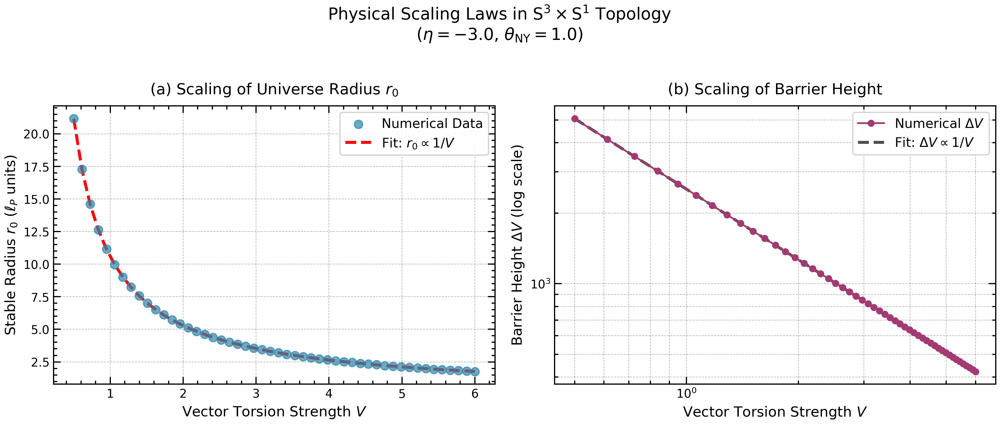
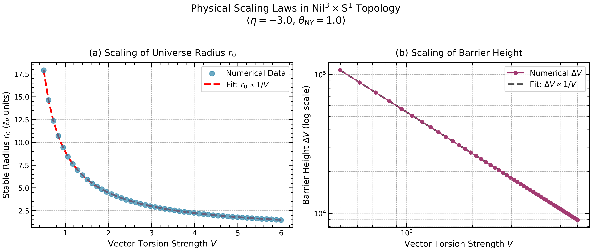

## 6. 代表点と安定性の質（Representative Points and Stability Quality）

本節では、相図上の代表点における $V_{\mathrm{eff}}(r)$ の具体形と安定性指標を示し、Type I/II/III の操作的定義（Sec. 2.6）との対応を明確化する。

### 6.1 代表点の選定基準

各トポロジーで典型的な安定・不安定挙動を示す点を選ぶ。  
結合定数は $V=4.0$、コンパクト化スケール $L=1$、 $\kappa=1$ とする。

1. Type I：明確な障壁を伴う準安定井戸（ $\Delta V>0$ ）  
2. Type II：極小はあるが障壁が消失・極小化した点  
3. Type III：許容領域内に安定極小がない点

### 6.2 $S^3 \times S^1$ の代表点

#### 6.2.1 代表点一覧

| Point | $\eta$ | Type | $r_0$ | $\log_{10}(r_0)$ | $\Delta V$ | $\log_{10}(\Delta V)$ |
|---|---:|---|---:|---:|---:|---:|
| S1 | $-3.0$ | I | $2.65$ | $0.42$ | $633$ | $2.80$ |
| S2 | $-2.0$ | I/II 境界 | $2.00$ | $0.30$ | --- | --- |
| S3 | $0.0$ | II | $0.87$ | $-0.06$ | --- | --- |
| S4 | $3.0$ | III | --- | --- | --- | --- |

（ $\theta_{\mathrm{NY}}=1.0$ ）

#### 6.2.2 各点の特徴

- **S1（Type I, $\eta=-3$）**  
  負の $\eta$ により torsion 起源の負寄与（ $B\propto\eta$ ）が強く働き、深い井戸と高障壁を形成する。
- **S2（I/II 境界, $\eta=-2$）**  
  $C=9\eta^2-36=0$ の臨界点。極小は残るが障壁は消失し、Type I と Type II の境目となる。
- **S3（Type II, $\eta=0$）**  
  torsion 駆動が弱まり、 $C=-36<0$ により極小はあるが障壁を持たない。
- **S4（Type III, $\eta=3$）**  
  $C$ と $B$ がいずれも安定化に寄与せず、単調型で極小を作らない。

### 6.3 $T^3 \times S^1$ の代表点

#### 6.3.1 代表点一覧

| Point | $\eta$ | Type | $r_0$ | $\log_{10}(r_0)$ | $\Delta V$ | $\log_{10}(\Delta V)$ |
|---|---:|---|---:|---:|---:|---:|
| T1 | $-3.0$ | I | $2.25$ | $0.35$ | $1.4\times10^4$ | $4.15$ |
| T2 | $0.0$ | III | --- | --- | --- | --- |

（ $\theta_{\mathrm{NY}}=1.0$ ）

#### 6.3.2 各点の特徴

- **T1（Type I, $\eta=-3$）**  
  平坦背景でも、負 $\eta$ の torsion 効果で安定井戸が形成される。  
- **T2（Type III, $\eta=0$）**  
  flux 寄与が消え、 $T^3$ では幾何学側も中立なため安定極小を作れない。

### 6.4 $Nil^3 \times S^1$ の代表点

#### 6.4.1 代表点一覧

| Point | $\eta$ | Type | $r_0$ | $\log_{10}(r_0)$ | $\Delta V$ | $\log_{10}(\Delta V)$ |
|---|---:|---|---:|---:|---:|---:|
| N1 | $-3.0$ | I | $2.24$ | $0.35$ | $1.3\times10^4$ | $4.13$ |
| N2 | $-0.6$ | I | $0.38$ | $-0.42$ | $18.9$ | $1.28$ |
| N3 | $0.0$ | III | --- | --- | --- | --- |

（ $\theta_{\mathrm{NY}}=1.0$ ）

#### 6.4.2 各点の特徴

- **N1（Type I, $\eta=-3$）**  
  深い安定領域。 $r_0,\Delta V$ は T1 と近く、大きな負 $\eta$ では topology 差より flux 効果が支配的。  
- **N2（Type I, $\eta=-0.6$）**  
  安定境界近傍。Type I は維持するが障壁高は N1 より大幅に小さい。  
- **N3（Type III, $\eta=0$）**  
  負の torsion 駆動が消え、負曲率のみでは安定化に不十分。

### 6.5 安定性指標の可視化

#### 6.5.1 障壁高スケーリング

Type I 点を比較すると、 $r_0$ と $\Delta V$ に強い正相関が見える。  
Fig.17〜19 に $\Delta V$ と $r_0$ の関係を示す。

#### Fig.17: Scaling laws ($S^3,\ \eta=-3.0,\ \theta=1.0$)

#### Fig.18: Scaling laws ($T^3,\ \eta=-3.0,\ \theta=1.0$)

#### Fig.19: Scaling laws ($Nil^3,\ \eta=-3.0,\ \theta=1.0$)

対数表示では

$$
\log \Delta V \sim \alpha \log r_0 + \mathrm{const.}
$$

の近似直線関係が観測され、 $\Delta V \propto r_0^\alpha$ 型の冪則を示唆する。  
これは

$$
V_{\mathrm{eff}}(r)\propto r(Ar^2+Br+C)
$$

という多項式構造と整合する。

### 6.6 解析境界と数値スキャンの整合性

#### 6.6.1 $S^3$ の境界

$C(\eta)=0$ から $\eta=-2,\ +2$ が得られる。  
数値でも S2（ $\eta=-2$ ）は I/II 境界に位置し、 $r_0=2.00$ は解析値

$$
r_0=-\frac{2B}{3A}=\frac{96}{48}=2
$$

と一致する。

#### 6.6.2 $T^3$ の閾値

$\eta=-3$ で数値検証すると、Type I 出現は $\theta_{\mathrm{NY}}\gtrsim0.8$。  
解析閾値 $\theta_{\mathrm{NY}}\approx0.87$ と整合する。

#### 6.6.3 $Nil^3$ の安定限界

$Nil^3$ では Type I 安定は $\eta\approx-0.6$ まで維持され、 $\eta=-0.5$ で失われる。  
これは「十分に負の $\eta$ が必要」という判別式条件と一致する。

### 6.7 まとめ

代表点解析から、次が確認できる。

1. 3トポロジーすべてで、大きな負 $\eta$ 側に堅牢な Type I が現れる  
2. 強い flux（大きな $|\eta|$）では topology 差が相対的に小さくなる  
3. $r_0$ と $\Delta V$ の正相関は共通して見られる

これらは、本論文の torsion 主導安定化機構を数値的に補強する結果である。
