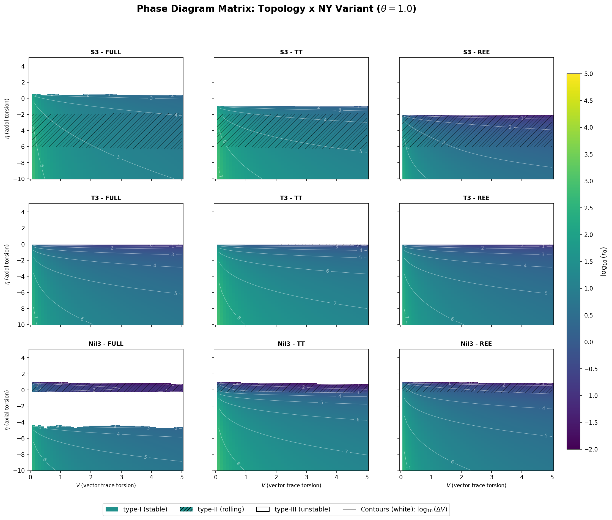

# DPPUv2 paper01: Topology-Dependent Phase Classification of Effective Potentials in Einstein-Cartan Gravity（アインシュタイン-カルタン重力における有効ポテンシャルのトポロジー依存位相分類）

[English README](README.md)




## 論文内容

- [正式なPDF（英語。LaTeXからビルドしたもの）](DPPUv2-paper01.pdf)
- [ドラフトの日本語版Markdown](20260101-01_paper_01_v2_2.md)

## ディレクトリ構造

- `LaTeX/` - LaTeX原稿とコンパイル済みPDF
  - `main.tex` - メインファイル
  - `sections/` - 各セクションのTeXファイル
  - `appendices/` - 付録のTeXファイル
  - `figures/` - 画像
- `data/` - 論文用データ
- `script/` - データ処理・可視化スクリプト
  - スクリプトの詳細については「[script/README](script/README_ja.md)」を参照ください。

## LaTeXのビルド方法

### 基本的なビルドコマンド

LaTeXディレクトリに移動してpdflatexを実行します。
LaTeXの相互参照（`\ref`、`\label`など）を正しく解決するため、**最低2回のコンパイルが必要**です。

- **1回目**: `.aux`ファイルにラベル情報を書き込む
- **2回目**: `.aux`ファイルから参照を読み込んで解決

参照が`??`と表示される場合は、もう一度コンパイルしてください。

```powershell
cd LaTeX
pdflatex -interaction=nonstopmode main.tex
pdflatex -interaction=nonstopmode main.tex
```

### 出力ファイル

ビルドが成功すると以下のファイルが生成されます：

- `main.pdf` - 最終的なPDFファイル（約3.5MB、79ページ）
- `main.aux` - 補助ファイル（相互参照情報）
- `main.log` - コンパイルログ
- `main.out` - hyperrefアウトライン情報

### トラブルシューティング

#### エラーが出る場合

エラーの確認：
```powershell
# ログファイルを確認
cat main.log | Select-String -Pattern "Error|Warning" | Select-Object -Last 20
```

#### クリーンビルド

一度すべての補助ファイルを削除してから再ビルド：
```powershell
cd LaTeX
Remove-Item *.aux, *.log, *.out, *.synctex.gz, *.fdb_latexmk, *.fls -ErrorAction SilentlyContinue
pdflatex -interaction=nonstopmode main.tex
pdflatex -interaction=nonstopmode main.tex
```

## 著者

Muacca

## ライセンス

リポジトリ直下の LICENSE ファイルを参照してください。
